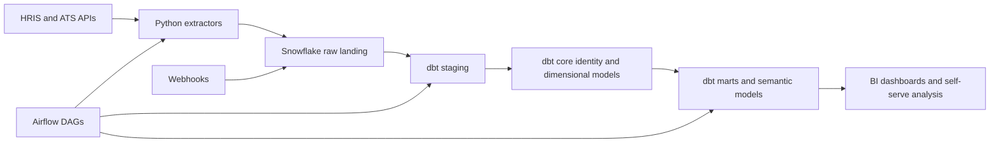
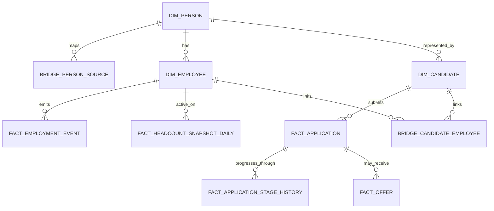

# People Analytics Foundation Design

Downloadable version: [HTML](sandbox:/mnt/data/people_analytics_design_doc.html) · [Markdown](sandbox:/mnt/data/people_analytics_design_doc.md)

## Executive Summary

This design proposes a concise, implementation-ready People Analytics foundation for a modern HR and recruiting stack. The recommended pattern is API-first ingestion with custom Python extractors, orchestration in Airflow, append-only raw landing in Snowflake, and governed transformations plus semantic definitions in dbt. The design explicitly prefers direct extraction over managed connectors, while keeping Workday custom reports delivered as web services as a pragmatic fallback where direct REST access is unavailable or insufficient. Public documentation supports this stack well: Workday public material documents REST, SOAP, and RaaS-style access patterns; Greenhouse documents Harvest endpoints for core recruiting entities; Ashby documents cursor- and `syncToken`-based incremental sync; dbt documents sources, tests, snapshots, and semantic models; Snowflake documents `COPY INTO`, `MERGE`, and policy-based security; and Airflow documents idempotent, retry-safe task design. citeturn28view0turn24view1turn24view3turn13view0turn29view0turn24view5turn29view1turn24view8turn24view7turn24view9

The roadmap is intentionally phased. Phase 1 delivers the HR core: canonical identity, employee and employment modelling, SCD Type 2 employee profile history, lifecycle events, headcount snapshots, and governed workforce metrics such as active headcount, hires, terms, attrition, internal mobility, promotions, and manager span of control. Phase 2 adds recruiting: candidates, applications, requisitions or openings, stage history, offers, hire conversion, and recruiting metrics such as pipeline conversion, time in stage, time to hire, requisition ageing, and offer acceptance. Phase 3 adds compensation and surveys under stricter access controls. A future phase extends the same model to workforce planning and forecast comparisons against approved plan. This phasing keeps the first delivery credible for hiring managers while still showing that the foundation scales into a broader people data platform.

The core modelling decision is to separate three ideas that are often conflated. A `person_key` represents the canonical real-world person across systems. An `employee_key` represents a warehouse-managed HR employee record, usually tied to a source worker or employee identifier. An `employment_episode_key` represents a contiguous hire-to-term period. This distinction is what makes rehire handling correct. If the HR system issues a new employee or worker id on rehire, the design allocates a new `employee_key` and a new `employment_episode_key`, but keeps the existing `person_key`. That preserves person-level continuity without corrupting employment history.

Several items remain intentionally marked as **unspecified** until implementation review. Exact Workday object coverage and field availability are tenant- and permission-dependent. Survey privacy thresholds, compensation visibility rules, and any payroll or equity source integrations are also unspecified. The public Workday material is enough to justify the design direction, but not enough to assert a final field inventory without tenant access and security review. citeturn24view1turn24view2turn28view0

## Architecture Summary Page

| Area | Recommended design choice |
|---|---|
| Business objective | Build a governed People Analytics foundation that answers joiner, mover, leaver, recruiting, compensation, and engagement questions from one conformed warehouse model |
| Source strategy | Direct Python extractors first. Use Workday RaaS only when direct REST access is unavailable or insufficient |
| Orchestration | Airflow DAGs with partitioned, retry-safe tasks and explicit upstream/downstream dependencies |
| Landing pattern | Append-only raw ingestion into Snowflake, preserving payload, run metadata, source ids, and watermarks |
| Transformation pattern | dbt sources, tests, incremental models, snapshots, marts, and semantic models |
| Canonical identity | `person_key` + source bridge registry + `employee_key` + `employment_episode_key`, with explicit candidate-to-employee bridge logic |
| Historical strategy | SCD Type 2 for employee profile history; periodic daily or monthly headcount snapshots; stage history for recruiting |
| Security pattern | Least-privilege Snowflake roles, restricted schemas for PII and compensation, masking policies, row access policies, and thresholded survey marts |
| Initial outcomes | Daily workforce mart, daily recruiting mart, documented definitions, lineage, tests, freshness checks, and privacy-aware access layers |

The diagram below summarises the proposed operating model. Airflow’s core abstraction is the DAG, which defines schedules, tasks, dependencies, retries, and operational controls, while the UI surfaces task state and logs. dbt’s source declarations, freshness checks, tests, snapshots, and semantic models fit naturally after raw landing in Snowflake. citeturn25view2turn29view6turn24view4turn24view5turn29view0turn29view1turn29view2



A hiring-manager version of the same summary can be stated in one sentence: **API-first ingestion, append-only raw storage, canonical identity, rehire-aware employee modelling, and governed marts delivered in phases.**

## Scope, Assumptions, and Roadmap

The scope is a People Analytics data foundation, not a full HR operations platform. The objective is to make workforce and recruiting questions answerable from governed warehouse tables with clear grain, lineage, and access controls. The foundation is designed to support self-serve analysis later, but its first obligation is metric correctness and data trust.

**Assumptions**

- The primary HRIS is Workday, and it remains the source of truth for active workforce, organisation structure, and employment status.
- The primary ATS is either Greenhouse or Ashby. The model supports both, but a single production tenant is expected to dominate in the MVP.
- The initial organisation size is roughly 1,000 to 5,000 employees. At this scale, full daily HR snapshots are operationally reasonable if robust deltas are not yet exposed. One published Workday RaaS integration example notes limits in the millions of rows per call, which makes a worker population of this size modest by comparison in that context. citeturn23search0turn24view1
- Workday exact field inventory through direct REST is **unspecified** until tenant access, scopes, and object coverage are reviewed. Publicly documented examples do show custom report fields such as Workday ID, preferred name, username, terminated flag, work email, and employee ID, which are sufficient to justify an MVP worker model. citeturn24view1
- Survey privacy thresholds, compensation visibility rules, and whether equity or payroll data are in scope are **unspecified** for the initial design.
- Fuzzy auto-merge of identities is out of scope for MVP. Ambiguous matches should fall to manual review rather than silent automation.

**Foundational business questions**

| Domain | Questions this design should answer |
|---|---|
| Core workforce | How many active employees do we have now, by department, location, level, manager, and job family? How is that changing weekly and monthly? |
| Joiners and leavers | How many hires and terminations occurred in a period? What is voluntary and involuntary attrition? What does attrition look like by cohort and manager tree? |
| Internal movement | Who moved teams, changed managers, changed level, or was promoted? How often? From where to where? |
| Recruiting funnel | How many candidates entered the funnel? How many reached each stage? Where are requisitions ageing? |
| Recruiting efficiency | What is time to hire, time in stage, offer acceptance rate, and source-of-hire conversion? |
| Hiring conversion | Which ATS hires resolved into HR employees? How quickly? Where are hire handoffs or identity links failing? |
| Compensation | How have salary, bonus, or equity values changed over time, by band, level, and organisation? |
| Engagement | What is survey participation and engagement, at privacy-safe reporting levels? |
| Planning | How do actual headcount and hiring progress compare with approved or budgeted plan? |

**Phased roadmap**

| Phase | Scope | Key deliverables |
|---|---|---|
| Phase 1 | Core HR | Workday ingestion, identity registry, workforce dimensions, employee lifecycle facts, daily or monthly headcount snapshots, core workforce metrics mart |
| Phase 2 | Recruiting | ATS ingestion, candidate and application models, requisition or opening models, stage history, offer facts, candidate-to-employee bridge, recruiting metrics mart |
| Phase 3 | Compensation and surveys | Compensation change facts, compensation band models, restricted survey ingestion, aggregated engagement marts, privacy controls |
| Future | Workforce planning | Planned-versus-actual headcount, open roles versus plan, quarterly hiring attainment, scenario and forecast models |

**Prioritised MVP table list**

| Priority | Phase | Table | Grain | Purpose |
|---|---|---|---|---|
| 1 | Phase 1 | `raw_hris_worker` | one raw payload row per extracted worker record | Immutable landing with lineage and replay safety |
| 2 | Phase 1 | `stg_hris_worker_latest` | one current row per HR worker id | Typed, deduped employee source |
| 3 | Phase 1 | `bridge_person_source` | one row per source record to canonical person | Identity registry |
| 4 | Phase 1 | `dim_person` | one row per canonical person | Shared identity anchor |
| 5 | Phase 1 | `dim_employee` | one row per warehouse employee record | HR employee reference layer |
| 6 | Phase 1 | `dim_employee_profile_scd` | one row per employee profile version | SCD Type 2 profile history |
| 7 | Phase 1 | `fact_employment_event` | one row per lifecycle event | Hires, terms, transfers, promotions |
| 8 | Phase 1 | `fact_headcount_snapshot_daily` | one row per active employee per day | Historical workforce state |
| 9 | Phase 1 | `mart_workforce_metrics_daily` | one row per date x reporting slice | Governed headcount and attrition metrics |
| 10 | Phase 2 | `stg_ats_candidate_latest` | one row per candidate id | Candidate master |
| 11 | Phase 2 | `fact_application` | one row per application | Funnel and conversion base |
| 12 | Phase 2 | `fact_application_stage_history` | one row per application x stage interval | Time-in-stage and conversion |
| 13 | Phase 2 | `fact_offer` | one row per offer or offer version | Offer analytics and hire conversion |
| 14 | Phase 2 | `bridge_candidate_employee` | one row per reconciled candidate-to-employee link | Hire linkage and identity continuity |
| 15 | Phase 2 | `mart_recruiting_metrics_daily` | one row per date x requisition or source slice | Recruiting semantic layer |
| 16 | Phase 3 | `fact_compensation_change` | one row per comp event | Salary or comp movement |
| 17 | Phase 3 | `fact_survey_response_restricted` | one row per response | Restricted raw survey store |
| 18 | Phase 3 | `mart_engagement_agg` | one row per approved survey slice above privacy threshold | Safe survey reporting |

This table is intentionally biased toward a fast, credible MVP rather than a maximal first delivery. The smallest useful Phase 1 can stop at tables 1 to 9 and still deliver high-value reporting.

## Source Systems and API-First Ingestion Design

The preferred ingestion strategy is **direct API extraction with Python**. Managed connectors are not required in the base design and should only be considered as a fallback if access, throttling, or vendor-specific complexity becomes a blocker. The documented source patterns are strong enough to justify bespoke extraction: Workday supports REST, SOAP, and RaaS execution patterns; Greenhouse Harvest is explicitly designed to export internal candidate and job data; and Ashby documents API authentication, pagination, incremental synchronisation, and signed webhooks. Snowflake then provides a clean raw landing target, and Airflow provides orchestration discipline around retries and partitions. citeturn28view0turn24view1turn24view3turn13view0turn13view3turn24view8turn24view9

**Source-system notes**

| Source | Documented public access pattern | MVP recommendation | Representative public fields or resources | Status of full field inventory |
|---|---|---|---|---|
| HRIS | Workday SOAP, REST, and RaaS-style report execution are publicly described in connector and report setup material | Use direct REST if worker, organisation, and employment resources are available. Otherwise build a Workday custom RaaS report for worker and org extracts | Public RaaS example shows Workday ID, preferred first name, preferred last name, user name, terminated flag, public primary work email, and employee ID | **Unspecified** until tenant review |
| ATS option A | Greenhouse Harvest API exposes candidates, applications, jobs, offers, job stages, and webhooks. Harvest v3 uses OAuth 2.0 client credentials | Use Harvest API for batch extraction. Add webhooks for near-real-time events and reconciliation | Applications support `created_after` and `last_activity_after`. Offers support `updated_after`, `resolved_after`, `sent_after`, and `starts_after` | Representative, not exhaustive |
| ATS option B | Ashby API is RPC-style over POST with HTTP Basic auth. Many list endpoints support cursor pagination and incremental sync with `syncToken` | Use list/info endpoints for base extraction and signed webhooks for events | `application.list`, `application.info`, `application.listHistory`, `job.list`, `opening.list`, `jobPosting.list`, webhooks such as `jobPostingUpdate` and e-signature or offer updates | Representative, not exhaustive |

The documented behaviour behind this table comes directly from the public vendor documentation. Greenhouse explicitly positions Harvest as a way to read or modify candidates, jobs, and offers and notes that Harvest v3 uses OAuth 2.0 client credentials. Ashby explicitly documents `syncToken`-based incremental sync and RPC-style POST endpoints. Workday public examples explicitly document custom report creation with “Enable as Web service”, the “Workers for HCM Reporting” data source, and report URL generation from the UI. citeturn24view3turn10search0turn13view0turn13view1turn33search0turn33search1turn24view1turn28view0

**Raw landing pattern**

Python extractors should write JSON payloads plus ingestion metadata into Snowflake-managed raw tables. For batch loads, the cleanest pattern is to drop files into a Snowflake internal or external stage and then `COPY INTO` append-only raw tables. Snowflake documents loading from named internal and external stages, and `COPY INTO` supports column matching when file and table column names align. citeturn24view8turn20search9

A minimal raw table schema for the initial draft is enough. It does not need a large observability surface on day one.

| Column | Why it is worth keeping in the MVP |
|---|---|
| `_ingested_at_utc` | Load timestamp for lineage and freshness |
| `_source_system` | HRIS, ATS, survey, compensation, webhook |
| `_source_object` | workers, applications, offers, openings, etc. |
| `_run_id` | Airflow run tracing and replay |
| `_extract_mode` | full, incremental, event |
| `_source_record_id` | Stable vendor-side primary key when exposed |
| `_source_updated_at` | Vendor-side update timestamp when exposed |
| `_watermark_or_cursor` | Delta boundary or cursor used for the request |
| `_is_deleted` | Soft-delete indicator when the source exposes it |
| `_payload_hash` | Dedup and replay protection |
| `raw_payload` | Complete JSON stored as `VARIANT` |

That metadata set is deliberate: enough for replay, auditing, and debugging, but not so much that the initial design becomes observability-heavy before the first marts exist.

**Full versus incremental versus event-based extraction**

The practical choice depends on source volume and documented API behaviour.

| Mode | Concrete example | Sensible pattern for a 1k–5k employee company | When it makes sense |
|---|---|---|---|
| Full snapshot | Workday worker profile extract through RaaS or worker API | One full worker snapshot nightly; optionally a lighter intra-day refresh if needed | Best initial HR strategy when reliable change tracking is unavailable or tenant-specific |
| Incremental | Greenhouse applications with `last_activity_after`; Greenhouse offers with `updated_after`; Ashby `application.list` with `syncToken` | Pull only changed applications or offers every 1 to 4 hours | Best for ATS tables that change often and expose clear delta fields |
| Event-based | Greenhouse candidate stage change or candidate hired webhook; Ashby candidate or job posting webhook | Land webhooks continuously and still run scheduled reconciliation jobs | Best for near-real-time alerts and stage transitions |

The batch and event patterns above are directly documented. Greenhouse applications expose `created_after` and `last_activity_after`, and the webhook catalogue includes application, offer, candidate hired, candidate stage change, and job events. Greenhouse also includes a delivery id in the `Greenhouse-Event-ID` header and signs payloads with a secret-derived signature. Ashby documents full sync, paginated follow-up requests with `nextCursor`, incremental requests using `syncToken`, signed webhook requests via `Ashby-Signature`, and a stable `webhookActionId` across retries. citeturn7view1turn26view4turn32view0turn32view1turn32view2turn32view3turn13view0

**Small-data illustration**

| Record | `source_updated_at` | Included in full run? | Included in incremental run with watermark `2026-05-08 00:00:00`? | Captured by webhook? |
|---|---:|---|---|---|
| Employee A | 2026-05-01 09:00 | Yes | No | Usually no, unless an event source exists |
| Employee B | 2026-05-08 08:12 | Yes | Yes | Possibly |
| Employee C | 2026-05-08 12:31 | Yes | Yes | Possibly |
| Application X | 2026-05-07 15:25 | Yes | No | No |
| Application Y | 2026-05-08 09:10 | Yes | Yes | Yes, if stage or status changed |
| Offer Z | 2026-05-08 10:42 | Yes | Yes | Yes, if offer updated or accepted |

For a company with 5,000 employees, the profile dimension is small enough that a daily full HR pull is usually the cleanest first move. Recruiting volumes are often larger and more volatile, so incremental extraction plus webhooks is a better default. A sensible first cadence is: nightly HR full snapshot, ATS deltas every 1 to 4 hours, and webhook ingestion whenever events arrive.

**Concrete API examples**

- Workday full worker snapshot: custom RaaS report built on “Workers for HCM Reporting”, exposed as a web service, returning JSON. Public examples show report URL generation and JSON output retrieval. citeturn24view1
- Greenhouse incremental applications: `GET /v1/applications?last_activity_after=<ISO-8601>&per_page=500&page=1`. citeturn7view1
- Greenhouse incremental offers: `GET /v1/offers?updated_after=<ISO-8601>` or `resolved_after=<ISO-8601>`. citeturn26view4
- Ashby initial full sync: `POST /application.list { "limit": 100 }`, following `nextCursor` until `moreDataAvailable=false`, then storing `syncToken`. citeturn13view0
- Ashby incremental sync: `POST /application.list { "syncToken": "<prior value>", "limit": 100 }`. citeturn13view0turn13view1

## Canonical Identity, Warehouse Layers, and Dimensional Model

The canonical identity model is the heart of this design. It is what allows HR and recruiting to be analysed together without assuming that vendor ids are stable, global, or rehire-safe.

**Key definitions**

| Key | Meaning | Why it exists |
|---|---|---|
| `person_key` | Warehouse-generated canonical identity for the real-world person | Groups the same individual across HRIS, ATS, survey, and future systems |
| `employee_key` | Warehouse-generated identity for a specific HR employee or worker record | Preserves source lineage when the HR system issues new worker ids |
| `employment_episode_key` | Warehouse-generated identity for one contiguous hire-to-term period | Handles rehires and episode-based tenure correctly |
| `candidate_key` | Warehouse-generated identity for a specific ATS candidate record | Keeps ATS identity separate from canonical person identity |
| `application_key` | Warehouse-generated identity for a single ATS application | Supports one-to-many candidate-to-job histories |
| `candidate_employee_bridge_key` | Warehouse-generated key for link rows between candidate and employee records | Makes hire conversion and audit logic explicit |

A good default is to allocate these warehouse keys from Snowflake sequences for identity-bearing dimensions and to use deterministic hashed keys where composite matching is useful in staging or facts. Snowflake documents sequence-generated values as globally unique under normal sequence semantics, while dbt documents both surrogate-key generation and incremental matching via `unique_key`. citeturn29view5turn24view6turn22search1

**Identity resolution process**

1. If the incoming source record already exists in `bridge_person_source`, reuse the mapped `person_key`.
2. Otherwise, attempt deterministic high-confidence matching in a restricted schema:
   - exact corporate email match;
   - exact employee number, if exposed in both systems;
   - explicit hire linkage from ATS to HRIS, where available.
3. If a confident match exists, assign the existing `person_key`.
4. If the person is new, allocate a new `person_key`.
5. Always allocate a new `employee_key` for a new HR employee or worker id.
6. Allocate a new `employment_episode_key` whenever the person begins a new contiguous employment stint.
7. If matching is ambiguous, do **not** auto-merge in MVP. Create a review case instead.

**Small identity-resolution illustration**

| Incoming source record | Observed source id | Email | Result |
|---|---|---|---|
| ATS candidate | `GH_CAND_550` | `ann.lee@example.com` | New `candidate_key`, new `person_key=501` |
| HR worker after hire | `WD_WORKER_1001` | `ann.lee@example.com` | Reuse `person_key=501`, allocate `employee_key=8001`, `employment_episode_key=9001` |
| HR rehire later with new worker id | `WD_WORKER_1440` | `ann.lee@example.com` | Reuse `person_key=501`, allocate `employee_key=8044`, `employment_episode_key=9002` |

In the rehire example, the person does **not** split into two people. The employee identity and employment episode split, which is exactly what you want analytically.

The logic above is consistent with how the documented sources behave. Greenhouse exposes candidate, application, offer, and hire-related events; Greenhouse common webhook attributes also include candidate id, application id, job id, and externally supplied ids where relevant. Ashby documents candidate and application resources separately, and Workday public examples show worker-centric reporting fields rather than a cross-system canonical person id. The warehouse therefore needs its own canonical identity layer. citeturn32view0turn14view1turn14view2turn24view1



**Merge and correction flow**

Identity corrections should be explicit and auditable.

- `bridge_person_source` stores the current source-to-person mapping plus `match_method`, `match_confidence`, and timestamps.
- `person_merge_history` records any survivor/merged-person decisions.
- `person_resolution_case` stores ambiguous matches for review.
- Downstream marts should resolve through the survivor `person_key`, not through hard-updated fact tables where possible.
- Hard deletions should be avoided. Use soft supersession fields such as `is_active` and `superseded_by_person_key`.

**Snowflake layers and dbt structure**

| Layer | Responsibility | Typical objects |
|---|---|---|
| `raw` | Append-only source landing | raw worker payloads, raw application payloads, raw webhook events |
| `base` | Typed flattening from raw JSON | base workers, base applications, base offers |
| `stage` | Renaming, standardisation, dedupe, latest-row logic | `stg_hris_worker_latest`, `stg_ats_application_latest` |
| `core` | Canonical identity, dimensions, facts | `dim_person`, `dim_employee`, `fact_employment_event` |
| `marts` | Business-ready reporting models | workforce and recruiting marts |
| `semantic` | Metric definitions on top of marts | semantic models and metrics |

A clean dbt project layout can remain compact:

```text
models/
  sources/
  staging/hris/
  staging/ats/
  core/identity/
  core/hr/
  core/recruiting/
  marts/workforce/
  marts/recruiting/
  marts/compensation/
  marts/surveys/
  semantic/
snapshots/
macros/
tests/
```

This structure follows dbt’s own recommendations around declared sources, source freshness, tests, snapshots, and semantic models. Sources create lineage, snapshots track changing rows, tests assert model integrity, and semantic models provide central metric definitions. citeturn24view4turn30view0turn30view1turn29view0turn24view5turn29view1

**Dimensional model overview**

| Table | Grain | History strategy | Notes |
|---|---|---|---|
| `dim_person` | one row per canonical person | current-state dimension | Shared across HR, ATS, survey |
| `bridge_person_source` | one row per source record mapping | type 1 with audit columns | Stores source lineage and match method |
| `dim_employee` | one row per warehouse employee record | current-state dimension | One per HR worker or employee id |
| `dim_employee_profile_scd` | one row per employee profile version | SCD Type 2 | Department, manager, job, level, location |
| `fact_employment_event` | one row per lifecycle event | append-only | Hire, term, transfer, promotion, rehire |
| `fact_headcount_snapshot_daily` | one row per active employee per day | periodic snapshot | Can be rolled to month for lighter marts |
| `dim_candidate` | one row per ATS candidate record | current-state dimension | ATS-specific identity |
| `fact_application` | one row per application | current-state fact with audit columns | Candidate-to-job base |
| `fact_application_stage_history` | one row per application x stage interval | append-only or rebuilt history | Time in stage and conversion |
| `fact_offer` | one row per offer or offer version | append-only or versioned | Offer status, start date, acceptance |
| `bridge_candidate_employee` | one row per resolved candidate-employee link | audit-tracked bridge | Hire conversion logic |
| `fact_compensation_change` | one row per comp event | append-only | Restricted |
| `mart_engagement_agg` | one row per approved survey slice | aggregated only | Privacy-safe downstream access |

The following transform patterns are adapted directly from documented dbt snapshot and incremental guidance plus Snowflake `MERGE` behaviour. citeturn24view5turn24view6turn24view7

```sql
-- dbt snapshot for employee profile history

  {{
    config(
      target_schema='snapshots',
      unique_key='employee_key',
      strategy='timestamp',
      updated_at='source_updated_at'
    )
  }}

  select
      employee_key,
      person_key,
      department_key,
      job_key,
      manager_employee_key,
      location_key,
      employment_status,
      source_updated_at
  from {{ ref('stg_hris_worker_latest') }}

```

```sql
-- daily headcount snapshot generation
select
    d.date_day as snapshot_date,
    e.employee_key,
    e.person_key,
    e.department_key,
    e.job_key,
    e.manager_employee_key,
    e.location_key
from {{ ref('dim_date') }} d
join {{ ref('dim_employee_current') }} e
  on d.date_day between e.employment_start_date
                    and coalesce(e.employment_end_date, '2999-12-31'::date)
where e.is_employee = true;
```

```sql
-- identity bridge insert or update
merge into core.bridge_person_source t
using prepared_identity_matches s
  on t.source_system    = s.source_system
 and t.source_object    = s.source_object
 and t.source_record_id = s.source_record_id
when matched then update set
    t.person_key       = s.resolved_person_key,
    t.match_method     = s.match_method,
    t.match_confidence = s.match_confidence,
    t.updated_at_utc   = current_timestamp()
when not matched then insert (
    bridge_person_source_key,
    person_key,
    source_system,
    source_object,
    source_record_id,
    match_method,
    match_confidence,
    created_at_utc
) values (
    seq_bridge_person_source.nextval,
    s.resolved_person_key,
    s.source_system,
    s.source_object,
    s.source_record_id,
    s.match_method,
    s.match_confidence,
    current_timestamp()
);
```

If source timestamps are unreliable, dbt’s `check` snapshot strategy is the fallback, but the `timestamp` strategy is the better default when a trustworthy update timestamp exists. citeturn24view5turn17search2

## Orchestration, Data Quality, Governance, and Access Controls

The orchestration layer should be simple and explicit. Airflow models workflows as DAGs made of tasks and dependencies, and its own guidance emphasises that tasks must be idempotent, must not produce partial results, and should produce the same result on retry. That strongly aligns with this design: extract tasks should write immutable raw batches, transform tasks should use partitioned logic, and warehouse upserts should be explicit. Airflow also warns against relying on local task filesystem state across workers, which supports the choice to persist exchange artefacts in Snowflake stages or directly in warehouse tables rather than in transient per-worker filesystems. citeturn25view2turn25view0turn25view1

A sensible first Airflow layout is:

| DAG | Frequency | Core tasks |
|---|---|---|
| `hris_daily` | nightly | extract HRIS → land raw → dbt stage/core → dbt tests → publish workforce marts |
| `ats_incremental` | every 1 to 4 hours | extract ATS deltas → land raw → dbt stage/core → dbt tests → publish recruiting marts |
| `webhook_ingest` | continuous or micro-batch | receive signed webhook → dedupe by event id → land raw events |
| `restricted_phase3` | nightly | compensation and survey loads → restricted marts → privacy checks |

**Data quality and monitoring**

dbt’s built-in testing model is sufficient for a strong first draft. It supports `not_null`, `unique`, `accepted_values`, and `relationships` tests, and dbt source freshness provides explicit staleness thresholds and machine-readable outputs for alerting. In practice, the minimum test layer for this project should include:

- unique and not-null tests on all warehouse keys and source natural keys;
- relationships tests from facts to dimensions;
- accepted-values tests on statuses such as employee status, application status, and offer status;
- source freshness on raw HRIS and ATS tables;
- custom tests for overlapping SCD Type 2 intervals and overlapping employment episodes for the same employee;
- row-count delta checks at the extract layer;
- webhook dedupe by `Greenhouse-Event-ID` or Ashby `webhookActionId`. citeturn29view0turn30view2turn30view1turn32view0turn32view3

Monitoring should stay close to the operating surfaces already in the stack.

- Airflow UI for DAG status, retries, task logs, and run diagnostics. citeturn29view6
- dbt test and freshness outputs for pipeline health. citeturn30view1turn30view0
- Snowflake query history and warehouse usage for load runtime, cost, and latency.
- Alerting on stale sources, failed tests, materially abnormal row-count changes, and unresolved identity-review queue growth.

**Governance and access control**

Snowflake’s access model is role-based, and its row access and masking policy features are a strong fit for People data. Roles are granted privileges on securable objects, masking policies protect sensitive columns at query time, and row access policies restrict visible rows based on policy logic. This design should use those primitives directly. Compensation, direct identifiers, and identifiable survey response data should live in restricted schemas that are not granted to general analytics roles. Public Snowflake documentation also makes clear that row access policies are evaluated before masking policies when both apply, which is useful when building layered protection for sensitive People datasets. citeturn29view2turn29view3turn29view4

A practical starting role model is:

| Role | Access |
|---|---|
| `PA_PLATFORM_ADMIN` | Infrastructure, grants, policies, restricted schemas |
| `PA_ENGINEER` | Raw, staging, core, marts, but not unrestricted HR PII unless separately approved |
| `PA_ANALYST` | Curated marts and semantic models only |
| `PA_SENSITIVE_HR` | Approved access to restricted employee identifiers |
| `PA_COMP` | Compensation restricted objects |
| `PA_SURVEY_RESTRICTED` | Raw survey responses where policy permits |

Two design rules matter here. First, the matching service account may need restricted access to controlled identifiers to resolve identity, but downstream analysts do not. Second, survey reporting should be thresholded before broad exposure. The exact threshold, suppression policy, and exception handling remain **unspecified** because they are organisational policy decisions, not vendor defaults.

**Recommended publication pattern**

- Publish conformed marts for broad usage.
- Publish semantic models only on top of those marts, not directly on raw or restricted tables.
- Keep metric definitions central and documented.
- Version identity logic carefully. A bad merge is worse than a missing match.

## Prioritized Primary Sources

The following sources were the most useful public references for this design and are the ones I would keep at hand during implementation:

| Area | Prioritised references |
|---|---|
| Workday access patterns | urlPublic Workday connector reference on Microsoft Learnturn28view0 · urlPublic RaaS custom report example on Microsoft Learnturn24view1 |
| Greenhouse extraction and events | urlGreenhouse Harvest API overviewturn24view3 · urlGreenhouse Harvest API referenceturn1search0 · urlGreenhouse Recruiting webhooks referenceturn32view0 |
| Ashby extraction and events | urlAshby API docs hometurn33search4 · urlAshby pagination and incremental sync guideturn13view0 · urlAshby webhook setup guideturn32view1 · urlAshby webhook authentication guideturn32view2 |
| dbt modelling and quality | urldbt sources guideturn24view4 · urldbt data tests guideturn29view0 · urldbt source freshness command referenceturn30view1 · urldbt snapshots guideturn24view5 · urldbt semantic models guideturn29view1 |
| Snowflake loading and security | urlSnowflake COPY INTO table referenceturn24view8 · urlSnowflake MERGE referenceturn24view7 · urlSnowflake access control overviewturn29view2 · urlSnowflake row access policies guideturn29view3 · urlSnowflake masking policy referenceturn29view4 |
| Airflow orchestration | urlAirflow DAG conceptsturn25view2 · urlAirflow best practicesturn24view9 · urlAirflow architecture overviewturn29view6 |

**Open questions and limitations**

The single largest implementation unknown remains detailed Workday tenant coverage. Public material is sufficient to confirm that REST, SOAP, and RaaS-style access patterns exist, and that worker reporting can be exposed through custom reports, but the final worker, organisation, and compensation field inventory should still be treated as **unspecified until tenant access and permission review are complete**. Survey privacy thresholds and compensation visibility rules are likewise policy questions that must be set with stakeholders before Phase 3. citeturn28view0turn24view1turn24view2