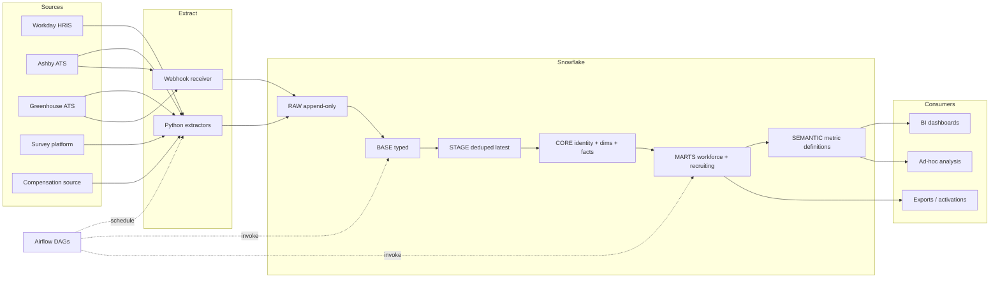
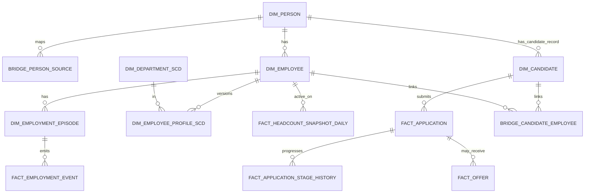

# People Analytics Foundation — Design Document

> A 0-to-1 design for a governed People Analytics data platform. Written for a North-American fintech in the 1,000–5,000 employee range with Canadian regulatory exposure (PIPEDA, Quebec Law 25) and likely cross-border data flows (CCPA, GDPR for EU staff, US EEO reporting). The companion repository implements the design end-to-end.

**Audience.** This document targets a senior data/analytics engineering reviewer. It assumes familiarity with dimensional modelling, dbt, Snowflake, Airflow, and HR/recruiting data shapes.

**Non-goals.** This is not an HR operations platform, a compensation administration tool, or a survey collection system. It is the *analytical* foundation that integrates those systems' data into one governed model.

---

## 1. Executive Summary

This design proposes a concise, implementation-ready People Analytics foundation built around five anchors:

1. **API-first ingestion** with custom Python extractors against Workday, the chosen ATS (Ashby for the MVP build, Greenhouse supported as a swap-in), and survey/compensation sources in later phases. Managed connectors are not used; the public APIs are mature enough for direct extraction and the resulting code becomes a long-lived asset rather than a vendor dependency.
2. **Append-only raw landing in Snowflake** with a small, deliberate set of lineage metadata columns on every payload. Raw is immutable; nothing downstream is allowed to mutate it.
3. **Canonical identity model** built on three keys — `person_key`, `employee_key`, `employment_episode_key` — that survive job changes, rehires, and HRIS migrations. This is the single most consequential modelling decision in the document and is the prerequisite for trustable joiner/mover/leaver analytics.
4. **dbt-owned transformations** through layered staging, core, marts, and a documented semantic layer. Every metric the business will quote has one definition, in one place, that powers every dashboard and every ad-hoc query.
5. **Privacy as a design constraint, not a bolt-on.** Restricted schemas, row access policies, masking policies, k-anonymity thresholds for survey data, audit through Snowflake `ACCESS_HISTORY`, and an explicit GDPR/PIPEDA right-to-erasure pattern are all part of the model from day one.

**The phased roadmap.** Phase 1 delivers HR core: identity, employee modelling, SCD Type 2 profile history, lifecycle events, daily headcount snapshots, and a workforce metrics mart covering active headcount, hires, terminations, attrition, internal mobility, promotions, and span of control. Phase 2 adds recruiting: candidates, applications, requisitions, stage history, offers, hire conversion, and a recruiting metrics mart. Phase 3 adds compensation and surveys behind stricter access controls. A future phase extends the model to workforce planning and forecast comparisons. The smallest credible Phase 1 stops at nine tables and still delivers high-value reporting on day one.

**What is intentionally `unspecified`.** Tenant-level Workday object coverage and field availability are permission-dependent and should be confirmed during integration review. Survey privacy thresholds default to k≥5 in this document but are ultimately an organisational policy decision. Compensation visibility rules and any payroll/equity source integrations are out of scope for this document and called out explicitly.

**One-sentence summary for a non-technical reader.** *API-first ingestion, append-only raw storage, a canonical employee record that survives rehires and system changes, point-in-time-correct workforce reporting, and one shared definition of every metric — delivered in phases.*

---

## 2. Why This Design — Tradeoffs Considered

A design is only as good as the tradeoffs it makes visible. The following choices are deliberate, not defaults.

| Decision | Chosen | Considered and rejected (for this scale) | Why |
|---|---|---|---|
| Ingestion approach | Custom Python extractors | Fivetran / Airbyte managed connectors | Vendor connectors abstract away exactly the parts of People data we need to control: identity, deletes, late-arriving effective dates, and rate-limited backfill. At 1k–5k employees the daily volume is small; the engineering cost of bespoke extractors is recovered the first time a connector silently changes a column type. |
| Warehouse | Snowflake | BigQuery, Redshift | Snowflake's row access policies, masking policies, dynamic data masking, and `ACCESS_HISTORY` audit map cleanly onto People data sensitivity rules. The design is portable in principle, but the Snowflake security primitives shorten the privacy implementation by weeks. |
| Transformation | dbt | Stored procedures, Spark, Dataform | dbt is the de-facto tool for warehouse-native modelling, and the JD-implied "semantic layer ownership" maps directly onto dbt's metric/semantic-model artefacts. Stored procedures sacrifice testing and lineage; Spark is over-engineered for the workload. |
| Orchestration | Airflow | Prefect, Dagster, dbt Cloud schedulers | Airflow's DAG model and operational maturity are sufficient and well-known. The orchestration layer is intentionally thin: it runs extractors and `dbt build`, nothing more. The design would port to Prefect or Dagster with a day of work. |
| Semantic layer | dbt semantic models / MetricFlow | LookML, Cube, hand-rolled `metrics.yml` | Keeps the metric definitions in the same repository, version control, and review path as the models they sit on. The BI tool can consume from the warehouse views generated by MetricFlow without needing to re-implement metric logic in LookML. |
| Snapshot cadence (HR) | Nightly full snapshot | CDC, hourly delta | At 5k employees, a full HR snapshot is a few megabytes and runs in seconds. CDC adds tenant configuration and replay complexity that pays off only at much larger scales. Documented as a tradeoff to revisit at >50k headcount. |
| Identity matching | Deterministic only in MVP | Probabilistic / ML matching | A bad merge is far worse than a missing match in HR data. Probabilistic matching is a future-phase consideration with explicit human review in the loop. |
| ATS for MVP | Ashby | Greenhouse | Both are supported in code. Ashby's `syncToken` incremental model and signed-webhook pattern are slightly more modern and produce a more interesting reference implementation; the Greenhouse path is documented and trivially swappable. |

The tradeoffs above are revisited in §16 (*Where this design doesn't apply*) for explicit failure modes.

---

## 3. Architecture at a Glance

| Area | Choice |
|---|---|
| Sources | Workday (HRIS), Ashby (ATS, MVP) / Greenhouse (ATS, swappable), survey + compensation sources in later phases |
| Extraction | Direct Python extractors. Workday RaaS as documented fallback. Webhooks for near-real-time events |
| Landing | Append-only `RAW_*` tables in Snowflake with lineage metadata + full JSON `VARIANT` payload |
| Transformation | dbt: `base` → `stage` → `core` → `marts` → `semantic` |
| Orchestration | Airflow DAGs, idempotent and retry-safe, parameterised by `data_interval_start` |
| Identity | `person_key` (canonical) + `employee_key` (HR record) + `employment_episode_key` (contiguous stint) |
| History | SCD Type 2 for employee profile + department; SCD Type 1 for current-state lookups; daily headcount snapshots; SCD Type 3 only where two-version history is genuinely needed (rare in HR) |
| Time correctness | Effective-dated SCD2 keyed on `effective_date`, separate from `entry_date`; bi-temporal columns on every history table |
| Security | Role-based access; restricted schemas for PII, compensation, raw surveys; row access + masking policies; survey k≥5 thresholding; `ACCESS_HISTORY` audit |
| Observability | Airflow UI, dbt tests + freshness, Elementary for dbt-native data observability, Snowflake query history |
| BI | Tool-agnostic by default; metric layer is dbt semantic models / MetricFlow so any consumer (Looker, Tableau, Hex, Mode, Power BI) reads the same numbers |



---

## 4. Scope, Assumptions, and Phased Roadmap

### 4.1 Assumptions

- **Primary HRIS is Workday**, source of truth for active workforce, organisation, and employment status. Workday's first-class extraction surface for HCM is RaaS (Reports-as-a-Service) and the SOAP `Get_Workers` operation; REST coverage of HCM is partial and tenant-dependent. The design defaults to RaaS for full worker extracts and uses REST for incremental/lookup endpoints where they exist.
- **Primary ATS is Ashby for the MVP** with Greenhouse fully supported as a swap-in. Both are implemented in code; only one is wired into the production DAG schedule.
- **Headcount range 1,000–5,000.** A daily full HR snapshot is operationally trivial at this scale. The design notes where this assumption breaks (§16).
- **Workforce includes multiple worker types**: full-time employees, part-time, contractors, contingent workers, and interns. The data model treats `employee` as one of several `worker_type` values and `is_employee` is a derived predicate, not a primary attribute.
- **Bi-temporal correctness matters.** Effective-dated changes (a promotion *effective* last Monday but *entered* today) must show in history at the right point on the timeline. This is a hard requirement for headcount and attrition correctness.
- **Privacy regimes that apply**: Canadian PIPEDA, Quebec Law 25 (formerly Bill 64), CCPA for California-based staff, GDPR for any EU-resident staff, and US EEO-1 reporting requirements where applicable. Specific obligations are owned by Legal/Privacy; the design provides the technical primitives.
- **Fuzzy auto-merge of identities is out of scope for the MVP.** Ambiguous matches route to a manual review queue.

### 4.2 Foundational business questions

| Domain | Questions the foundation must answer |
|---|---|
| Core workforce | How many active workers do we have *as of any date*, by department, location, level, manager chain, job family, and worker type? How is that changing weekly and monthly? |
| Joiners and leavers | How many hires and terminations occurred in a period? What is voluntary, involuntary, and regrettable attrition? What does attrition look like by tenure cohort and manager tree? |
| Internal movement | Who moved teams, changed managers, changed level, or was promoted? How often? From where to where? What share of senior roles is filled internally? |
| Recruiting funnel | How many candidates entered the funnel? What is the conversion rate at each stage? Where are requisitions ageing? |
| Recruiting efficiency | Time to hire, time in stage, offer acceptance rate, source-of-hire conversion. |
| Hiring conversion | Which ATS hires resolved into HR employees? How quickly? Where are hire handoffs failing or identity links breaking? |
| Compensation | How have salary and bonus values changed over time, by band, level, and organisation? (Phase 3) |
| Engagement | Survey participation and engagement at privacy-safe reporting levels. (Phase 3) |
| Planning | How do actual headcount and hiring progress compare to approved plan? (Future) |

### 4.3 Phased roadmap

| Phase | Scope | Key deliverables |
|---|---|---|
| 1 | Core HR | Workday ingestion, identity registry, workforce dimensions, employee lifecycle facts, daily headcount snapshots, core workforce metrics mart, semantic definitions for hires/terms/active headcount/attrition |
| 2 | Recruiting | Ashby ingestion (Greenhouse swap-in), candidate and application models, requisition and opening models, stage history, offer facts, candidate-to-employee bridge, recruiting metrics mart and semantic layer |
| 3 | Compensation and surveys | Compensation change facts, comp band model, restricted survey ingestion, threshold-aggregated engagement marts, expanded privacy controls |
| Future | Workforce planning | Planned-vs-actual headcount, open roles vs plan, quarterly hiring attainment, scenario and forecast models |

### 4.4 Prioritised MVP table list

| Pri | Phase | Table | Grain | Purpose |
|---|---|---|---|---|
| 1 | 1 | `raw_hris_worker` | one raw payload per extracted worker | Immutable landing, replay-safe |
| 2 | 1 | `dim_date` | one row per date | Date spine for snapshots and time logic |
| 3 | 1 | `stg_hris_worker_latest` | one row per HR worker id (current) | Typed, deduped employee source |
| 4 | 1 | `bridge_person_source` | one row per source record → person | Identity registry |
| 5 | 1 | `dim_person` | one row per canonical person | Shared identity anchor |
| 6 | 1 | `dim_employee` | one row per warehouse employee record | HR employee reference |
| 7 | 1 | `dim_employee_profile_scd` | one row per employee profile version (effective-dated SCD2) | Profile history |
| 8 | 1 | `dim_department_scd` | one row per department version (SCD2) | Reorg-safe history |
| 9 | 1 | `fact_employment_event` | one row per lifecycle event | Hires, terms, transfers, promotions, rehires |
| 10 | 1 | `fact_headcount_snapshot_daily` | one row per active worker per day | Historical workforce state |
| 11 | 1 | `mart_workforce_metrics_daily` | one row per date × reporting slice | Governed workforce metrics |
| 12 | 2 | `stg_ats_candidate_latest` | one row per candidate id | Candidate master |
| 13 | 2 | `fact_application` | one row per application | Funnel base |
| 14 | 2 | `fact_application_stage_history` | one row per application × stage interval | Time in stage / conversion |
| 15 | 2 | `fact_offer` | one row per offer or offer version | Offer analytics |
| 16 | 2 | `bridge_candidate_employee` | one row per resolved candidate→employee link | Hire conversion |
| 17 | 2 | `mart_recruiting_metrics_daily` | one row per date × requisition or source slice | Recruiting metrics |
| 18 | 3 | `fact_compensation_change` | one row per comp event | Comp movement (restricted) |
| 19 | 3 | `fact_survey_response_restricted` | one row per response (restricted) | Raw survey store |
| 20 | 3 | `mart_engagement_agg` | one row per approved slice above k-threshold | Privacy-safe engagement reporting |

The smallest useful Phase 1 stops at table 11 and still answers every question in §4.2's first three rows.

---

## 5. Source Systems and API-First Ingestion

### 5.1 Source-system summary

| Source | Public access pattern | MVP recommendation | Representative entities | Field inventory status |
|---|---|---|---|---|
| Workday HRIS | SOAP (`Get_Workers`), REST (partial HCM coverage), and RaaS custom reports exposed as JSON web services | Use a Workday RaaS report on the *Workers for HCM Reporting* data source for the nightly full worker extract; supplement with REST endpoints where they exist for organisation, location, and job catalogue | Worker, Position, Job, Organization, Location, Compensation, Time Off | **Unspecified** until tenant access and security review |
| Ashby ATS | RPC-style POST endpoints over HTTP Basic auth. List endpoints support `nextCursor` pagination and `syncToken` incremental sync. Signed webhooks via `Ashby-Signature` header with stable `webhookActionId` for dedupe | Use list/info endpoints for base extraction and signed webhooks for events | `application.list`, `application.info`, `application.listHistory`, `job.list`, `opening.list`, `jobPosting.list`; webhooks: `applicationSubmit`, `applicationUpdate`, `jobPostingUpdate`, offer events | Representative, not exhaustive |
| Greenhouse ATS (swap-in) | Harvest REST API. Authentication is **HTTP Basic with an API key as the username and an empty password** (not OAuth). Webhooks signed with an HMAC-SHA256 over the body using a configured secret; `Greenhouse-Event-ID` header for dedupe | Use Harvest endpoints for base extraction and webhooks for events | `/v1/candidates`, `/v1/applications` (`created_after`, `last_activity_after`), `/v1/jobs`, `/v1/offers` (`updated_after`, `resolved_after`, `sent_after`, `starts_after`), `/v1/job_stages` | Representative, not exhaustive |

### 5.2 Raw landing pattern

Python extractors write JSON payloads plus ingestion metadata into Snowflake-managed raw tables. For batch loads the cleanest pattern is to stage files in a Snowflake internal stage and `COPY INTO` append-only raw tables; for streaming/webhook payloads the extractor inserts directly via the Snowflake Python connector with explicit batching and retries.

A minimal raw schema is enough for the MVP. The metadata is deliberately small but sufficient for replay, audit, and debugging.

| Column | Purpose |
|---|---|
| `_ingested_at_utc` | Load timestamp for lineage and freshness |
| `_source_system` | `hris_workday`, `ats_ashby`, `ats_greenhouse`, `survey_*`, `comp_*`, `webhook_*` |
| `_source_object` | `worker`, `application`, `offer`, `opening`, etc. |
| `_run_id` | Airflow run id for tracing and replay |
| `_extract_mode` | `full`, `incremental`, `event` |
| `_source_record_id` | Stable vendor primary key when exposed |
| `_source_updated_at` | Vendor-side update timestamp |
| `_effective_date` | Effective date of the change (Workday-style sources only) |
| `_watermark_or_cursor` | Delta boundary, cursor, or `syncToken` used for the request |
| `_is_deleted` | Soft-delete indicator from source |
| `_payload_hash` | SHA-256 over the canonical JSON; dedupe + replay protection |
| `raw_payload` | Full JSON stored as `VARIANT` |

### 5.3 Full / incremental / event extraction

| Mode | Concrete example | Cadence at 1k–5k headcount | When it makes sense |
|---|---|---|---|
| Full snapshot | Workday RaaS worker extract | Nightly | First-best HR strategy when reliable change tracking is unavailable or tenant-specific |
| Incremental | Ashby `application.list` with `syncToken`; Greenhouse applications with `last_activity_after` | Every 1–4h | Best for ATS tables that change often and expose clear delta fields |
| Event | Ashby signed webhooks; Greenhouse signed webhooks | Continuous | Best for near-real-time alerts and stage transitions, with a scheduled reconciliation job that catches missed deliveries |

Concrete API call examples:

- Workday RaaS: `GET https://services1.{region}.myworkday.com/ccx/service/customreport2/{tenant}/{user}/{report}?format=json` (custom report on *Workers for HCM Reporting*, "Enable as Web service" turned on).
- Greenhouse incremental applications: `GET /v1/applications?last_activity_after=<ISO-8601>&per_page=500&page=1` with `Authorization: Basic <base64(api_key:)>`.
- Greenhouse incremental offers: `GET /v1/offers?updated_after=<ISO-8601>` or `&resolved_after=<ISO-8601>`.
- Ashby initial full sync: `POST /application.list` with body `{ "limit": 100 }`, follow `nextCursor` until `moreDataAvailable=false`, then store `syncToken`.
- Ashby incremental sync: `POST /application.list` with body `{ "syncToken": "<prior>", "limit": 100 }`.

### 5.4 Backfill strategy

First-time loads need an explicit plan. The default backfill path:

1. **HR**: a single Workday RaaS run with no date filter pulls the full current worker population. Historical employment events are reconstructed from worker effective-dated history if exposed, otherwise from a one-time historical RaaS extract per worker.
2. **ATS**: paginate through the full population once per entity (`candidate`, `application`, `offer`, `job`), respecting rate limits. Persist the resulting `syncToken` (Ashby) or `last_activity_after` watermark (Greenhouse) for incremental from that point forward.
3. **Webhooks**: backfill is *not* required — webhooks are forward-only. Reconciliation against scheduled extracts catches anything missed during deployment.

Backfill runs in a dedicated DAG with conservative concurrency, separate retry policy, and idempotent landing. Re-running the backfill DAG must be safe.

---

## 6. Canonical Identity Model

Identity is the single most consequential modelling decision in this design. Vendor identifiers are not stable across rehires, are not shared across systems, and occasionally change during HRIS migrations. Without a canonical identity layer, every joiner/mover/leaver question is fragile.

### 6.1 Key definitions

| Key | Meaning | Why it exists |
|---|---|---|
| `person_key` | Warehouse-generated canonical identity for the real-world person | Groups the same individual across HRIS, ATS, survey, and future systems |
| `employee_key` | Warehouse-generated identity for a specific HR worker record | Preserves source lineage when the HR system issues new worker ids |
| `employment_episode_key` | Warehouse-generated identity for one contiguous hire-to-term period | Handles rehires and tenure correctly |
| `candidate_key` | Warehouse-generated identity for a specific ATS candidate record | Keeps ATS identity separate from canonical person identity |
| `application_key` | Warehouse-generated identity for a single application | Supports one-to-many candidate-to-job histories |
| `candidate_employee_bridge_key` | Warehouse-generated key for resolved candidate→employee links | Makes hire conversion auditable |

Key allocation strategy:

- Snowflake **sequences** for identity-bearing dimension keys (`person_key`, `employee_key`, `employment_episode_key`, `candidate_key`).
- Deterministic **hashed surrogate keys** (`dbt_utils.generate_surrogate_key`) where composite matching is useful in staging and fact layers — e.g., `application_key` = hash of (source_system, candidate_id, job_id, applied_at).

### 6.2 Identity resolution process (deterministic only in MVP)

1. If the incoming source record already exists in `bridge_person_source` (matched on `source_system + source_object + source_record_id`), reuse the mapped `person_key`.
2. Otherwise, attempt deterministic high-confidence matching, performed in a restricted schema accessible only to the matching service account:
   - exact corporate email match (case-insensitive, normalised);
   - exact employee number match where both systems expose it;
   - explicit hire linkage from ATS to HRIS where the source provides it (Greenhouse `prospect_pool` linkage, Ashby `application.hireDetails`, Workday referral fields).
3. If a confident match exists, assign the existing `person_key`.
4. If the person is new, allocate a new `person_key`.
5. Always allocate a new `employee_key` when the HR system issues a new worker id, even if `person_key` is reused (rehire).
6. Allocate a new `employment_episode_key` whenever a person begins a new contiguous employment stint.
7. If matching is ambiguous, **do not auto-merge in MVP**. Insert a row into `person_resolution_case` and surface in an Airflow alert and a small dbt-doc-rendered review queue. Resolution is a manual decision; the engineer who resolves it leaves an audit trail.

### 6.3 The personal-email problem

Most ATS candidates apply with a personal email address; their corporate email is issued at hire. The exact-corporate-email rule above therefore *cannot* match an ATS candidate to their HRIS record on day one. The model handles this in three layers:

- **Pre-hire**: candidate carries a `candidate_key` and a tentative `person_key`. The ATS personal email is stored in the restricted identifier table for matching.
- **At hire**: the bridge step compares the candidate's personal email against any personal email captured during HRIS onboarding (Workday personal contact records when available), against employee number alignment, and against an explicit ATS→HRIS hire linkage event when the ATS provides one. If none match, the link is created from the offer record's `accepted_candidate_id` paired with the resulting `worker_id` within a small time window (e.g., 14 days), gated on department/location concordance.
- **Post-hire**: the corporate email becomes the durable identifier for future cross-system joins.

This is documented because in practice this is where most real-world identity errors are introduced. The MVP accepts a small percentage of unresolved hire links and surfaces them, rather than guessing.

### 6.4 Rehire walkthrough

| Incoming source record | Source id | Email | Result |
|---|---|---|---|
| ATS candidate applies | `ASH_CAND_550` | `ann.lee@gmail.com` (personal) | New `candidate_key=4001`, new `person_key=501` (no prior record) |
| Offer accepted, hired into HRIS | `WD_WORKER_1001` | `ann.lee@firm.com` (corporate, post-onboarding) | Resolve to existing `person_key=501` via offer→worker bridge in §6.3; allocate `employee_key=8001`, `employment_episode_key=9001` |
| Termination | `WD_WORKER_1001` term | n/a | Close `employment_episode_key=9001` with effective_end_date; do not delete `employee_key` |
| Rehire 18 months later, new worker id | `WD_WORKER_1440` | `ann.lee@firm.com` | Reuse `person_key=501`; allocate `employee_key=8044`, `employment_episode_key=9002` |

The rehire row is the design's central correctness check. The person does **not** split into two people. The employee identity and employment episode split, which is exactly what is wanted analytically: tenure resets per episode, but person-level continuity (cohort, demographics, prior performance) is preserved.

### 6.5 Identity correction infrastructure

- `bridge_person_source` stores the current source-to-person mapping plus `match_method`, `match_confidence`, and timestamps.
- `person_merge_history` records survivor/merged-person decisions with timestamps and an audit user. Merges are append-only.
- `person_resolution_case` stores ambiguous matches for manual review.
- Downstream marts always resolve through the survivor `person_key`. Fact tables are not hard-updated when a merge happens; the bridge resolves them at query time.
- Hard deletions are avoided. Soft-supersession fields `is_active` and `superseded_by_person_key` are used; the only exception is GDPR/PIPEDA right-to-erasure, handled in §11.

### 6.6 SCD types in this model

The JD specifically calls out SCD types 1, 2, and 3. Each has a place:

- **SCD Type 1** (overwrite-on-change) on `dim_person`, `dim_employee`, and `dim_candidate` for *current state only*. These are kept slim and joined only when the latest values are wanted.
- **SCD Type 2** (versioned with `valid_from`/`valid_to`) on `dim_employee_profile_scd` (department, manager, level, job, location, employment status) and `dim_department_scd`. This is the core history layer.
- **SCD Type 3** (single prior-value column) is *not* used by default in this design. It is mentioned for completeness and would only be used if a specific BI consumer needed an inline "previous_manager" column on a dimension and we judged the SCD2 join cost too high. In a column-store warehouse like Snowflake, that judgement is rare; SCD2 is almost always preferable.

### 6.7 Identity ER diagram



---

## 7. Dimensional Model

### 7.1 Snowflake layers

| Layer | Schema | Responsibility |
|---|---|---|
| Raw | `RAW` | Append-only landing; no transformation |
| Base | `BASE` | Typed flatten from raw VARIANT; one base view per source object |
| Stage | `STAGING` | Renaming, standardisation, dedupe, `latest` views |
| Core | `CORE` | Canonical identity, dimensions, facts |
| Restricted | `CORE_RESTRICTED`, `MARTS_RESTRICTED` | PII identifiers, compensation, raw survey responses |
| Marts | `MARTS` | Business-ready reporting models |
| Semantic | `SEMANTIC` | dbt semantic models / metric definitions |

### 7.2 Core tables

| Table | Grain | History | Notes |
|---|---|---|---|
| `dim_date` | one row per date | n/a | Calendar + fiscal calendar + ISO week, generated 2015–2035 |
| `dim_person` | one row per canonical person | SCD1 | Slim; sensitive identifiers in `dim_person_pii_restricted` |
| `bridge_person_source` | one row per source record | audit columns | Source lineage + match method + confidence |
| `dim_employee` | one row per warehouse employee record | SCD1 current-state | One per HR worker id |
| `dim_employment_episode` | one row per episode | append-only | `employment_episode_key`, start/end effective dates, ordinal per person |
| `dim_employee_profile_scd` | one row per profile version | SCD2 (effective-dated) | Department, manager, job, level, location, employment status, worker_type |
| `dim_department_scd` | one row per department version | SCD2 | Reorg-safe history |
| `dim_job` | one row per job code | SCD1 (or SCD2 if title/level fields change) | Job catalogue from Workday |
| `dim_location` | one row per location | SCD1 | |
| `dim_manager_chain` | one row per (employee, ancestor, depth) | derived per snapshot | Recursive flattening of manager hierarchy for span analysis |
| `fact_employment_event` | one row per lifecycle event | append-only | Hire, term, transfer, promotion, rehire, leave start/end |
| `fact_headcount_snapshot_daily` | one row per active worker per day | periodic snapshot | Generated by date spine join; rolled to monthly for older history |
| `dim_candidate` | one row per ATS candidate | SCD1 | |
| `fact_application` | one row per application | versioned | Candidate→job; current state with audit columns |
| `fact_application_stage_history` | one row per application × stage interval | append-only | Time in stage and conversion |
| `fact_offer` | one row per offer or offer version | versioned | Offer status, start date, acceptance |
| `bridge_candidate_employee` | one row per resolved candidate-employee link | audit-tracked | Hire conversion logic |
| `fact_compensation_change` | one row per comp event | append-only, restricted | |
| `fact_survey_response_restricted` | one row per response | restricted | |
| `mart_engagement_agg` | one row per approved slice | aggregated only, k≥5 | |

### 7.3 Worker type taxonomy

`worker_type` is a first-class attribute on `dim_employee_profile_scd`. The MVP uses these values:

| `worker_type` | Definition |
|---|---|
| `FT_EMPLOYEE` | Full-time regular employee |
| `PT_EMPLOYEE` | Part-time regular employee |
| `INTERN` | Intern or co-op |
| `CONTRACTOR` | Contractor on the company's payroll system or via agency, with a Workday record |
| `CONTINGENT` | Worker tracked in HRIS but not on company payroll (vendor staff, external consultants) |

`is_employee` is derived: `worker_type IN ('FT_EMPLOYEE','PT_EMPLOYEE','INTERN')`. Headcount metrics default to employees only; the design allows total-workforce metrics that include contractors and contingents on request, with a clear suffix in the metric name (e.g., `total_workforce_active`).

### 7.4 Manager chain / span of control

Every daily snapshot generates `dim_manager_chain` via a recursive CTE walking the employee→manager edges in `dim_employee_profile_scd` as of that date.

```sql
with recursive chain as (
    select
        snapshot_date,
        employee_key,
        manager_employee_key as ancestor_employee_key,
        1 as depth
    from {{ ref('fact_headcount_snapshot_daily') }}
    where manager_employee_key is not null

    union all

    select
        c.snapshot_date,
        c.employee_key,
        h.manager_employee_key,
        c.depth + 1
    from chain c
    join {{ ref('fact_headcount_snapshot_daily') }} h
      on c.ancestor_employee_key = h.employee_key
     and c.snapshot_date = h.snapshot_date
    where h.manager_employee_key is not null
      and c.depth < 20
)
select * from chain;
```

Span of control as of any date is a count of direct reports per manager:

```sql
select
    snapshot_date,
    ancestor_employee_key as manager_employee_key,
    count(distinct case when depth = 1 then employee_key end) as direct_reports,
    count(distinct employee_key) as total_org_size
from {{ ref('dim_manager_chain') }}
group by 1, 2;
```

### 7.5 Snapshot SQL and snapshot strategy

The dbt snapshot for employee profile uses the *effective-dated* SCD2 timestamp strategy:

```sql

{{
    config(
        target_schema='snapshots',
        unique_key='employee_key',
        strategy='timestamp',
        updated_at='effective_date',
        invalidate_hard_deletes=False
    )
}}
select
    employee_key,
    person_key,
    department_key,
    job_key,
    manager_employee_key,
    location_key,
    employment_status,
    worker_type,
    effective_date,
    source_updated_at
from {{ ref('stg_hris_worker_latest_effective') }}

```

Note `updated_at='effective_date'`. This is the difference between a textbook implementation and one that actually answers HR questions: the SCD2 boundaries follow effective date, not transaction time. See §8.

The daily headcount snapshot is generated by joining `dim_date` to the current employee population and filtering by employment dates:

```sql
select
    d.date_day as snapshot_date,
    e.employee_key,
    e.person_key,
    p.department_key,
    p.job_key,
    p.manager_employee_key,
    p.location_key,
    p.worker_type,
    p.employment_status
from {{ ref('dim_date') }} d
join {{ ref('dim_employment_episode') }} ep
    on d.date_day between ep.episode_start_date
                       and coalesce(ep.episode_end_date, '2999-12-31'::date)
join {{ ref('dim_employee') }} e
    on e.employee_key = ep.employee_key
join {{ ref('dim_employee_profile_scd') }} p
    on p.employee_key = e.employee_key
   and d.date_day between p.valid_from_date
                       and coalesce(p.valid_to_date, '2999-12-31'::date)
where p.employment_status = 'ACTIVE';
```

### 7.6 Identity bridge merge

```sql
merge into core.bridge_person_source t
using prepared_identity_matches s
   on t.source_system    = s.source_system
  and t.source_object    = s.source_object
  and t.source_record_id = s.source_record_id
when matched then update set
    t.person_key       = s.resolved_person_key,
    t.match_method     = s.match_method,
    t.match_confidence = s.match_confidence,
    t.updated_at_utc   = current_timestamp()
when not matched then insert (
    bridge_person_source_key,
    person_key,
    source_system,
    source_object,
    source_record_id,
    match_method,
    match_confidence,
    created_at_utc
) values (
    seq_bridge_person_source.nextval,
    s.resolved_person_key,
    s.source_system,
    s.source_object,
    s.source_record_id,
    s.match_method,
    s.match_confidence,
    current_timestamp()
);
```

---

## 8. Effective Dating and Point-in-Time Reporting

This section addresses the single most common source of metric incorrectness in HR analytics.

### 8.1 The two timelines

Workday and most enterprise HRIS are **effective-dated systems**. Every change has two distinct timestamps:

- **`effective_date`** — when the change is true in the real world (e.g., promotion *effective* 2026-01-01).
- **`entry_date`** / `_source_updated_at` — when the change was entered into the system (e.g., entered 2026-01-15, two weeks after it took effect).

If SCD2 boundaries are driven by `entry_date`, a promotion entered late will be invisible in historical headcount until its entry date. If a back-dated termination is entered after a snapshot has been taken, the historical headcount for that snapshot is now wrong. Both are common in HR.

### 8.2 The bi-temporal columns

Every history-bearing table in this design carries two pairs of date columns:

| Column | Meaning |
|---|---|
| `valid_from_date`, `valid_to_date` | Effective-time interval — when the row is "true" |
| `recorded_at_utc`, `superseded_at_utc` | Transaction-time interval — when the row was known to the warehouse |

The defaults for queries are:

- **Business reporting** uses effective-time. "Who was active on 2025-12-31?" means `valid_from_date <= '2025-12-31' < coalesce(valid_to_date, '2999-12-31')`.
- **Audit / restatement** uses transaction-time. "What did we *think* was true on 2026-01-15 about 2025-12-31?" means filter on both intervals.

This bi-temporal pattern is the foundation for restatement (§9) and is what makes *as-of* queries trustworthy.

### 8.3 As-of reporting macro

A small dbt macro encapsulates the as-of join so the rest of the codebase does not get it wrong:

```sql

select *
from {{ history_relation }}
where valid_from_date <= '{{ as_of_date }}'::date
  and coalesce(valid_to_date, '2999-12-31'::date) > '{{ as_of_date }}'::date
  and recorded_at_utc <= current_timestamp()

```

Used in models:

```sql
select *
from {{ as_of(ref('dim_employee_profile_scd'), 'employee_key', var('as_of_date')) }}
```

### 8.4 Headcount snapshot is generated from effective-time history, not stored independently

The daily snapshot is *derived* from the SCD2 history every night. Re-running the snapshot for a back-dated date range with `--vars '{"as_of_date_from": "2025-12-01", "as_of_date_to": "2025-12-31"}'` produces the corrected history. This is what makes restatement trivial: the snapshot is a view on history, not an independent source of truth.

---

## 9. Late-Arriving Facts, Back-Dated Edits, and Hard Deletes

### 9.1 Late-arriving raw payloads

Append-only raw is already late-arrival-safe: a record landed today with `_source_updated_at` last week becomes a new row in `RAW`. Downstream:

- The `stg_*_latest` views resolve the most recent payload per `_source_record_id` by `_source_updated_at`.
- The dbt snapshot, driven by `effective_date`, produces the correct SCD2 boundaries even when the data arrives out of order.
- The headcount snapshot is regenerated from history, so any back-dated effective change automatically corrects historical days the next time the snapshot runs.

### 9.2 Back-dated effective changes (Workday's classic case)

A promotion entered today, effective last Monday, is handled by:

1. Capturing `effective_date` from the Workday RaaS extract (or REST equivalent) into a dedicated raw column, *not* using transaction time.
2. The SCD2 snapshot uses `effective_date` as the strategy column.
3. The downstream daily headcount snapshot, when regenerated, joins the corrected SCD2 row and the historical days now show the corrected manager/department/level.

This is why §7.5 specifies `updated_at='effective_date'` rather than `'source_updated_at'`. The choice is non-obvious and worth flagging in any code review.

### 9.3 Restatement policy

Marts published to BI are *never* mutated in place. Instead:

- The mart is rebuilt from the corrected core tables.
- Restated rows are tagged with a `restated_at_utc` audit column and a `restatement_reason` enum.
- Downstream consumers see consistent published numbers between rebuilds; the restatement history is queryable.

For metrics that are external-facing (board decks, EEO-1 filings), a frozen `mart_*_published_v{n}` snapshot is preserved at publication time. Restatements produce `v{n+1}`; `v{n}` is read-only and audit-logged.

### 9.4 Hard deletes from source

A hard-deleted source record (a candidate purged from the ATS, an employee scrubbed for GDPR/PIPEDA) is detected one of two ways:

- **Explicit deletion event** from the source (Greenhouse `delete` webhooks, where available; Workday business processes).
- **Reconciliation diff** between a full extract and the warehouse population, run on a defined cadence per source (nightly for HR, weekly for ATS).

Detection sets `_is_deleted=TRUE` on the latest raw row and triggers a downstream supersession in the bridge and in `dim_*` tables. The fact tables remain intact (numbers do not retroactively change), but the dimension is marked inactive. For GDPR/PIPEDA right-to-erasure (§11), an additional purge step *replaces* identifying values with surrogate placeholders.

---

## 10. Orchestration, Testing, and Observability

### 10.1 Airflow

Airflow models workflows as DAGs of tasks with dependencies. Tasks must be **idempotent** (safe to retry), produce no partial side-effects, and rely only on the warehouse for state — never on the worker filesystem.

| DAG | Frequency | Tasks |
|---|---|---|
| `hris_daily` | Nightly (e.g., 02:00 UTC) | extract Workday → land raw → `dbt build --select tag:hris` → publish workforce marts |
| `ats_incremental` | Every 1–4h | extract ATS deltas → land raw → `dbt build --select tag:ats` → publish recruiting marts |
| `webhook_ingest` | Continuous | receive signed webhook → verify signature → dedupe by event id → land raw event |
| `reconcile_ats` | Daily | full ATS reconciliation extract → diff vs warehouse → flag missing/extra rows |
| `restricted_phase3` | Nightly | compensation + survey loads → restricted marts → privacy checks |
| `backfill` | Manual | parametrised full historical pull, conservative concurrency |

DAG conventions:

- `catchup=False` by default. Backfills are explicit.
- Watermarks come from `data_interval_start` / `logical_date`, never `datetime.now()`.
- Retries are explicit per task (`retries=3`, `retry_delay=timedelta(minutes=5)`, `retry_exponential_backoff=True`).
- SLA per DAG; alert routing per failure type.
- Secrets via Airflow Connections backed by AWS Secrets Manager or Azure Key Vault.

### 10.2 Data quality tests

Minimum dbt test layer for the MVP:

- `unique` and `not_null` on every warehouse key and every source natural key.
- `relationships` from facts to dimensions.
- `accepted_values` on enums (`employment_status`, `worker_type`, `application_status`, `offer_status`).
- `dbt source freshness` on raw HRIS and ATS sources, with explicit `warn_after` and `error_after`.
- Custom test for **overlapping SCD2 intervals** per `employee_key`.
- Custom test for **overlapping employment episodes** per `person_key`.
- Custom test for **headcount monotonicity sanity** (day-over-day delta within an expected band; alerts but doesn't fail).
- Row-count delta checks at the extract layer (anomalous spikes/drops).
- Webhook dedupe verification: count of distinct event ids equals count of webhook rows in any 24h window.

### 10.3 Observability

| Surface | Used for |
|---|---|
| Airflow UI | DAG/task status, retries, logs |
| dbt test + freshness output | Pipeline health and stale-source alerting |
| **Elementary** (or `dbt-artifacts`) | dbt-native data observability: anomaly detection on row counts, schema changes, test failures over time |
| Snowflake `QUERY_HISTORY` | Load runtime, warehouse usage, cost attribution |
| Snowflake `ACCESS_HISTORY` | Privacy audit (who queried what) — see §11 |
| OpenLineage (optional Phase 2+) | End-to-end lineage across extract → dbt → BI |
| Identity review queue | `person_resolution_case` size and ageing |

Alerts are routed by severity:

- Critical: failed extract, failed dbt build, source freshness `error_after` breached.
- Warning: anomalous row counts, identity review queue growing, monotonicity tripped.
- Informational: completed DAGs (low volume).

### 10.4 Schema evolution and data contracts

When Workday adds a field or Greenhouse renames a stage, the design tolerates it gracefully:

- Raw is JSON `VARIANT` — new fields are landed without schema changes.
- Base views explicitly project columns; a missing column produces a controlled failure rather than silent loss.
- dbt model contracts (dbt 1.5+ `contract:` blocks) on published marts and on `dim_employee_profile_scd` / `fact_employment_event` enforce stability for downstream consumers.
- A weekly job inspects the JSON schema of recent raw payloads and diffs against a tracked schema; new keys raise a low-severity ticket for the engineer.

---

## 11. Privacy, Governance, and Compliance

> Privacy is treated here the way a good engineer treats security — as a design constraint that is cheaper to honour up front than to retrofit.

### 11.1 Applicable regimes

The design must accommodate Canadian federal **PIPEDA**, **Quebec Law 25**, US **CCPA/CPRA**, **GDPR** for any EU-resident employee or candidate, and **US EEO-1** aggregated demographic reporting where applicable. The data model provides the *technical primitives* for compliance — restricted schemas, masking and row-access policies, k-anonymity thresholds, audit logging, and the right-to-erasure flow in §11.7. Specific obligations (lawful basis, consent capture, retention windows, subject-access response timelines) are owned by Legal and Privacy partners; this document does not attempt to substitute for that work.

### 11.2 Schema partitioning by sensitivity

| Schema | Contents | Default access |
|---|---|---|
| `RAW`, `BASE`, `STAGING` | Source landings + typed views | `PA_ENGINEER`; analyst access blocked |
| `CORE` | Non-sensitive dims and facts (keys, event types, dates, departments, jobs) | `PA_ENGINEER`, `PA_ANALYST` |
| `CORE_RESTRICTED` | Direct identifiers (name, email, address, DOB, government ids), demographic/protected attributes | `PA_SENSITIVE_HR`, matching service account |
| `CORE_COMP` | Compensation events and bands | `PA_COMP` |
| `CORE_SURVEY` | Raw survey responses | `PA_SURVEY_RESTRICTED` |
| `MARTS` | Conformed business marts (no direct identifiers) | `PA_ANALYST` |
| `MARTS_RESTRICTED` | Marts that combine identity with sensitive data (e.g., individual comp by manager) | role-by-role grant |
| `SEMANTIC` | Metric definitions (views) over `MARTS` | `PA_ANALYST` |

### 11.3 Roles

| Role | Access |
|---|---|
| `PA_PLATFORM_ADMIN` | Infrastructure, grants, policies, restricted schemas |
| `PA_ENGINEER` | Raw, base, stage, core, marts (non-restricted) |
| `PA_ANALYST` | Marts and semantic models only |
| `PA_SENSITIVE_HR` | Approved access to restricted employee identifiers |
| `PA_COMP` | Compensation restricted schema |
| `PA_SURVEY_RESTRICTED` | Raw survey responses |
| `PA_AUDITOR` | Read-only access to `ACCESS_HISTORY` and identity review queue, no business data |

### 11.4 Snowflake policy primitives

- **Masking policies** on direct identifiers in restricted views, applied via `WITH MASKING POLICY` on the restricted column. Default mask returns `'REDACTED'` to non-privileged roles.
- **Row access policies** on tables that mix demographic groups, suppressing rows for low-population slices to enforce k-anonymity downstream.
- Snowflake evaluates **row access policies before masking policies** when both apply on a query — relevant when designing layered protection.
- **`ACCESS_HISTORY`** queried daily and persisted to `audit.access_log` for retention beyond Snowflake's default window. Anomalous access patterns (volume, breadth, off-hours) raise alerts to `PA_AUDITOR`.

### 11.5 Survey thresholding (k-anonymity)

The `mart_engagement_agg` mart suppresses any reporting slice with fewer than **k=5 respondents**. The choice of 5 is a reasonable industry default; the actual threshold is an organisational policy decision and may be tightened (e.g., k=10) for highly sensitive items. Suppressed slices return a `NULL` score and a `suppressed_reason='below_threshold'` indicator so consumers see the absence explicitly rather than missing rows.

A second, less obvious risk is **differential disclosure** — repeated queries with different filters can isolate a person even when each individual query meets the threshold. Mitigation in this design:

- All survey reporting goes through `mart_engagement_agg`; the underlying `fact_survey_response_restricted` is not queryable by analysts.
- The mart enforces threshold at materialisation time; ad-hoc filters can only intersect to *more* suppressed slices, not fewer.
- High-sensitivity items (mental health, harassment) use a stricter k and may be reported only at organisation level.

### 11.6 Protected attributes and DEI reporting

Race, gender, disability status, veteran status, and similar protected attributes are stored in a separate restricted table `dim_person_protected_attributes` and joined into reporting only via approved aggregation marts. EEO-1 reporting marts aggregate to legally defined categories and apply the k-threshold; they are produced in a sealed pipeline and accessible only to the EEO reporting role. Individual values are never exposed to general analytics.

### 11.7 Right-to-erasure (GDPR / PIPEDA)

The hardest design problem in People Analytics privacy is the apparent conflict between two legitimate requirements: a person has the right to be erased from our systems, **and** historical headcount, attrition, and EEO reports must remain stable and reproducible. A naive "delete the row" implementation breaks every historical metric that included that person. A naive "ignore deletion" violates the law.

The design's answer is **separation of identity from contribution**. The `person_key` is a meaningless integer — it identifies *that an employee existed* without identifying *who they were*. Erasure removes the personally identifying attributes; the contribution to historical aggregates remains.

#### The erasure flow

1. **Intake.** Privacy team submits an erasure request via a tracked process (ticketing system, signed off by DPO or equivalent). The request carries the legal basis (GDPR Art. 17, PIPEDA principle, Law 25 right of de-indexation, etc. — the engineer does not need to evaluate this) and enough information to identify the person. An engineer with `PA_SENSITIVE_HR` access resolves the request to a `person_key` using the restricted identity tables. **The requester never sees `person_key` directly** — it is opaque.
2. **Approval gate.** A second engineer reviews the resolved `person_key` against the request to prevent erroneous erasure. Approval is recorded in `audit.erasure_request` with both engineers' identities and the request id.
3. **Execution.** The `erase_person` Airflow DAG runs against the approved request. The DAG is parameterised by `person_key` and `request_id` and is the *only* code path that can modify identifying data outside the normal pipeline.
4. **Verification.** Post-erasure, an automated check confirms (a) all marts rebuild successfully, (b) historical aggregates are unchanged within tolerance, and (c) no identifying value for the person remains in any non-tombstone column.
5. **Audit.** The DAG run, the SQL it executed, and the verification result are appended to `audit.erasure_log` and retained according to the legal retention policy (typically the longer of 7 years or the regulator's required period).

#### What the erasure macro does, layer by layer

| Layer | Action | Why |
|---|---|---|
| `RAW.*` (any source containing the person) | Replace `raw_payload` with a **tombstone payload** of identical JSON shape but with sensitive scalar values replaced by `'__ERASED__'` and arrays emptied. Retain `_source_record_id`, `_source_updated_at`, `_ingested_at_utc`. Set `_is_erased = TRUE`. | Preserves the *fact that an event happened* and its timing for audit, removes the personal data. Replay safety is maintained — the pipeline still parses the row, it just sees nulls where the name used to be. |
| `BASE.*`, `STAGING.*` | Re-derived from RAW on next dbt run. No special action needed. | Stateless views over RAW; correctness follows automatically. |
| `CORE_RESTRICTED.dim_person_pii` | Replace name, email, phone, address, government identifiers, DOB with surrogate placeholders (`'erased_<person_key>@erased.local'` for email, `NULL` for free-text fields). Set `is_erased = TRUE`, `erased_at_utc`, `erasure_request_id`. | Preserves referential integrity from `dim_person` while removing all identifying values. |
| `CORE.dim_person` | Retain `person_key`. Null `display_name`, `preferred_name`, any non-restricted attribute that could re-identify. Set `is_erased = TRUE`, `erased_at_utc`, `erasure_reason`. | The key remains so historical fact rows still join to *something*; the row no longer identifies a person. |
| `CORE.dim_employee`, `dim_candidate` | Same pattern — keep keys, null any local non-restricted attributes that could re-identify (e.g., LinkedIn URL captured into the candidate row). | Keys are preserved across the bridge so candidate→employee lineage is intact, but anonymised. |
| `CORE.bridge_person_source` | Retain rows. Mark `is_erased = TRUE`. The source record ids are kept (they're meaningless without the source system, and required for replay). | Bridge integrity is required for incremental ingestion to remain idempotent. |
| `CORE.fact_employment_event`, `fact_application`, `fact_offer`, `fact_compensation_change` (restricted) | **Untouched.** Facts join to `dim_person`/`dim_employee` by key; the rows still aggregate correctly but cannot be traced back to a person. Free-text columns on facts (e.g., `termination_notes`) are explicitly enumerated and tombstoned per row. | Aggregates remain stable. EEO-1 for 2023 still produces the same numbers in 2027 even after an erasure. |
| `MARTS.*`, `MARTS_RESTRICTED.*` | Rebuilt from CORE on the next scheduled run, plus an immediate forced rebuild as the last DAG step. | Published numbers reconcile to CORE within hours. |
| `audit.erasure_log` | Append row: `request_id, person_key, executed_at_utc, executed_by, sql_text, rows_affected, verification_result`. Retained per legal policy. | Demonstrates compliance to auditors and regulators. |

#### Sketch: the `erase_person` Snowflake procedure

```sql
create or replace procedure ops.erase_person(p_person_key number, p_request_id varchar)
returns variant
language sql
execute as owner
as
$$
declare
    v_rows_pii      number;
    v_rows_person   number;
    v_rows_employee number;
    v_rows_raw      number;
begin
    -- 1. Restricted PII table: replace identifying values, keep keys.
    update core_restricted.dim_person_pii
       set legal_first_name   = null,
           legal_last_name    = null,
           preferred_name     = null,
           personal_email     = 'erased_' || person_key || '@erased.local',
           corporate_email    = 'erased_' || person_key || '@erased.local',
           phone              = null,
           date_of_birth      = null,
           government_id_hash = null,
           home_address       = null,
           is_erased          = true,
           erased_at_utc      = current_timestamp(),
           erasure_request_id = :p_request_id
     where person_key = :p_person_key;
    v_rows_pii := sqlrowcount;

    -- 2. Public dim_person: retain key, null re-identifying attributes.
    update core.dim_person
       set display_name        = null,
           preferred_name       = null,
           is_erased            = true,
           erased_at_utc        = current_timestamp(),
           erasure_request_id   = :p_request_id
     where person_key = :p_person_key;
    v_rows_person := sqlrowcount;

    -- 3. dim_employee for every employee record this person had.
    update core.dim_employee
       set workday_username     = null,
           is_erased            = true,
           erased_at_utc        = current_timestamp()
     where employee_key in (
         select employee_key from core.dim_employee where person_key = :p_person_key
     );
    v_rows_employee := sqlrowcount;

    -- 4. RAW tombstones across every source touching this person.
    --    The mapping is via bridge_person_source.
    let cur cursor for
        select source_system, source_object, source_record_id
        from   core.bridge_person_source
        where  person_key = :p_person_key;
    for rec in cur do
        call ops.raw_tombstone(rec.source_system, rec.source_object, rec.source_record_id, :p_request_id);
    end for;

    -- 5. Audit.
    insert into audit.erasure_log (
        request_id, person_key, executed_at_utc, executed_by,
        rows_pii, rows_person, rows_employee, status
    ) values (
        :p_request_id, :p_person_key, current_timestamp(), current_user(),
        v_rows_pii, v_rows_person, v_rows_employee, 'SUCCESS'
    );

    return object_construct(
        'request_id',     :p_request_id,
        'person_key',     :p_person_key,
        'rows_pii',       v_rows_pii,
        'rows_person',    v_rows_person,
        'rows_employee',  v_rows_employee
    );
end;
$$;
```

The companion `ops.raw_tombstone` procedure walks the JSON payload and replaces a configured set of sensitive paths with `'__ERASED__'`, leaving the rest of the structure intact so downstream parsing does not break.

#### Verification check (runs as the last DAG step)

```sql
-- Aggregate-stability check: headcount for any historical date that
-- included this person must be unchanged versus a snapshot taken before
-- the erasure DAG ran.
select
    snapshot_date,
    pre_erasure_count,
    post_erasure_count,
    pre_erasure_count = post_erasure_count as ok
from audit.erasure_pre_post_check
where request_id = :request_id
  and ok = false;
-- Expected: zero rows. Any row indicates the erasure altered an
-- aggregate, which means a fact column carried identifying data
-- and the macro needs to be extended.
```

#### Edge cases the design handles

- **Erasure of a candidate who was never hired.** Only `dim_candidate`, `bridge_person_source`, ATS RAW rows, and `dim_person` are touched. No employment facts exist.
- **Erasure of a rehire (one person, multiple `employee_key`s).** All `employee_key` rows linked to the same `person_key` are processed in one transaction. The bridge guarantees the linkage.
- **Re-ingestion attempts after erasure.** The bridge marks the `source_record_id` as erased; the next normal extract will refresh the raw row, but a downstream guard on `bridge_person_source.is_erased` re-tombstones the new payload before it reaches CORE. This prevents identity leakage from incremental loads landing erased data again.
- **Mistaken erasure (rare but possible).** The audit log retains enough context to reconstruct the *fact* of erasure but not the data itself — by design. Reversal requires re-onboarding the person from the original source, which is the correct behaviour.
- **Right-to-portability vs right-to-erasure ordering.** A common pairing — the person requests both their data export *and* erasure. The export must complete and be verified delivered before the erasure DAG runs. The intake process enforces this ordering.

#### What this is *not*

- It is not a guarantee that every backup, every BI tool's cached extract, and every personal export sitting in an analyst's downloads folder is purged. Those are out-of-band concerns owned by IT/Security with their own retention controls.
- It is not a replacement for the org's broader privacy program (consent capture, DPIAs, breach response). It is the **warehouse-side** implementation that makes the broader program enforceable.

This pattern preserves **statistical truth without preserving identifiable data** — which is the only way to honour both an erasure request and a board request for last year's attrition number, on the same Tuesday afternoon.

### 11.8 Retention

| Data class | Default retention | Notes |
|---|---|---|
| Raw payloads | 25 months rolling | Long enough for audit and most restatement; configurable per source |
| `ACCESS_HISTORY` mirror | 7 years | Audit support |
| Identity review queue (resolved cases) | 7 years | Audit support |
| Demographic protected attributes | Per legal retention policy | |
| Survey responses (raw) | 24 months unless legal hold | Aggregated data retained indefinitely |

---

## 12. Environments, CI/CD, Secrets, and Cost

### 12.1 Environments

| Environment | Purpose | Snowflake account/db | dbt target |
|---|---|---|---|
| `dev` | Engineer sandboxes; per-engineer schemas | shared dev account, `PEOPLE_DEV` | `dev_<user>` |
| `ci` | Pull-request checks | shared dev account, ephemeral schemas `PEOPLE_CI_<sha>` | `ci_<sha>` |
| `staging` | Integration testing with sanitised production data | dedicated staging account, `PEOPLE_STG` | `stg` |
| `prod` | Production | dedicated prod account, `PEOPLE_PROD` | `prod` |

Sanitised data in `staging` is generated by a `mask_for_staging.sql` macro that replaces direct identifiers with synthetic values, preserving referential integrity. Production data is *never* copied to dev.

### 12.2 CI

- On PR open: lint (`sqlfluff`, `ruff`, `mypy`), `dbt parse`, `dbt build --select state:modified+` against the ephemeral CI schema, run all dbt tests on modified models and their downstreams ("slim CI"), Python unit tests, integration tests for extractors against recorded fixtures (no live API calls).
- On merge to `main`: deploy dbt artefacts and Python package; promote to staging.
- On tag: promote to production.

### 12.3 Secrets

- Snowflake authentication: **key-pair auth** (RSA), no passwords. Keys rotated quarterly via secret manager.
- API keys (Workday, Ashby, Greenhouse, survey vendor): stored in AWS Secrets Manager / Azure Key Vault, fetched at runtime. Never in environment files committed to the repo.
- Webhook signing secrets: same pattern, separate per-source.
- CI uses short-lived OIDC-issued credentials to the cloud secret manager.

### 12.4 Cost

Snowflake costs in this workload are dominated by the dbt build and ad-hoc analyst queries, not the extract. Defaults:

- Dedicated `PA_INGEST_WH` (XS) for landing — runs in seconds, scales to S during initial backfill.
- Dedicated `PA_TRANSFORM_WH` (S, auto-suspend 60s) for dbt builds.
- Dedicated `PA_ANALYST_WH` (S, auto-suspend 60s, multi-cluster up to 3) for BI and ad-hoc.
- Materialisation defaults: `view` for stage, `incremental` for facts, `table` for marts, `snapshot` for SCD2.
- A monthly cost report joins `WAREHOUSE_METERING_HISTORY` with dbt model metadata to attribute spend per model.

At 1k–5k headcount the expected daily warehouse credit consumption for the full pipeline is small (order of a few credits/day on S warehouses); the design is not constrained by cost at this scale and focuses on simplicity.

---

## 13. Semantic Layer and Metric Definitions

> One definition of every metric, in version control, consumable by every BI tool.

### 13.1 Semantic layer choice

The semantic layer is implemented in **dbt semantic models / MetricFlow**. Definitions live in YAML next to the models they reference; metric SQL is generated by MetricFlow and exposed to BI tools either through MetricFlow's server or by materialising metric views into the `SEMANTIC` schema for tools that read SQL directly.

This keeps metric definitions:

- in the same repository as the models;
- under PR review like any other change;
- generating the same numbers regardless of which BI tool consumes them.

### 13.2 Metric definitions

Below are the eight Phase 1 + Phase 2 metrics that every dashboard and ad-hoc analysis must use. Each is specified with formula, denominator choice, edge cases, and owner.

#### 13.2.1 Active headcount

- **Definition**: Distinct count of active employees (`worker_type IN ('FT_EMPLOYEE','PT_EMPLOYEE','INTERN')`, `employment_status='ACTIVE'`) as of a date.
- **Source**: `fact_headcount_snapshot_daily` (or as-of join on `dim_employee_profile_scd`).
- **Formula**: `count(distinct employee_key) where snapshot_date = <as_of_date>`.
- **Slice dimensions**: department, location, manager_chain (any depth), job_family, level, worker_type.
- **Edge cases**: workers on leave count as active (configurable via `include_on_leave` parameter, default `TRUE`); contractors and contingents excluded by default but available via `total_workforce_active`.
- **Owner**: People Analytics; consumed by HR, Finance, Leadership.

#### 13.2.2 Hires (period)

- **Definition**: Count of `fact_employment_event` rows where `event_type='HIRE'` and `effective_date` falls in the period.
- **Slice dimensions**: department, location, source_system, recruiter, hiring_manager, source_of_hire (from ATS).
- **Edge cases**: rehires counted separately as `event_type='REHIRE'`; combined view available as `hires_including_rehires`.
- **Owner**: People Analytics.

#### 13.2.3 Terminations (period)

- **Definition**: Count of `fact_employment_event` rows where `event_type='TERMINATION'` and `effective_date` in the period.
- **Sub-types**: `voluntary`, `involuntary`, `regrettable_voluntary` (a flagged subset of voluntary based on tenure × performance × eligibility-for-rehire — definition agreed with HR partners).
- **Owner**: People Analytics, with definition reviewed quarterly with HR.

#### 13.2.4 Attrition rate (annualised)

- **Definition**: `terminations_in_period / average_active_headcount_in_period × (12 / months_in_period)`.
- **Denominator choice**: average of (start-of-period active, end-of-period active). Documented because HR and Finance commonly disagree on this; the average method is the most defensible default.
- **Variants**: `voluntary_attrition_rate`, `regrettable_attrition_rate`, `involuntary_attrition_rate`.
- **Edge cases**: org changes mid-period preserve the original org for the leaver (attrition is attributed to where the person was, not where the role moved). Tenure cohorts use `current_tenure_band` calculated from `episode_start_date`.
- **Owner**: People Analytics; reconciled monthly with Finance.

#### 13.2.5 Internal mobility rate

- **Definition**: `internal_moves_in_period / average_active_headcount × annualisation_factor`.
- **Internal move** = a `fact_employment_event` with `event_type IN ('TRANSFER','PROMOTION','LATERAL_MOVE')` where `effective_date` in the period.
- **Owner**: People Analytics.

#### 13.2.6 Span of control

- **Definition**: `count(distinct direct_report_employee_key)` from `dim_manager_chain` where `depth=1`, per manager per snapshot date.
- **Aggregations**: average, median, percentile distribution by department/level.
- **Edge cases**: dotted-line reports excluded by default; a separate `span_including_dotted_line` metric is available when source captures it.
- **Owner**: People Analytics.

#### 13.2.7 Time to hire (recruiting)

- **Definition**: For applications that resulted in a hire, the number of business days between application submission and offer acceptance.
- **Formula**: `business_days_between(fact_application.applied_at, fact_offer.accepted_at)` for `fact_application` rows joined to `bridge_candidate_employee`.
- **Slice dimensions**: department, role level, source_of_hire, recruiter.
- **Edge cases**: applications without acceptance excluded; applications closed for non-fill reasons excluded; the metric reports a *median* by default because the distribution is heavily right-skewed.
- **Owner**: People Analytics; reconciled with Recruiting Ops.

#### 13.2.8 Offer acceptance rate

- **Definition**: `count(offers where status='ACCEPTED') / count(offers where status IN ('ACCEPTED','DECLINED','EXPIRED'))` over the period, by `effective_date` of the offer decision.
- **Edge cases**: offers withdrawn by the company excluded from both numerator and denominator (denominator filters on candidate-driven outcomes only).
- **Owner**: People Analytics; reconciled with Recruiting Ops.

#### 13.2.9 (Phase 3) Engagement score (survey)

- **Definition**: Mean response (1–5 scale) for the engagement question(s) defined by the survey vendor, aggregated per slice.
- **Suppression**: any slice with fewer than k=5 respondents returns NULL with `suppressed_reason='below_threshold'`.
- **Owner**: People Analytics, in coordination with the survey vendor's defined methodology.

### 13.3 MetricFlow YAML example

```yaml
semantic_models:
  - name: workforce
    model: ref('mart_workforce_metrics_daily')
    entities:
      - name: employee
        type: foreign
        expr: employee_key
      - name: department
        type: foreign
        expr: department_key
    dimensions:
      - name: snapshot_date
        type: time
        type_params:
          time_granularity: day
      - name: worker_type
        type: categorical
      - name: employment_status
        type: categorical
    measures:
      - name: active_employees
        agg: count_distinct
        expr: case when employment_status = 'ACTIVE' and is_employee then employee_key end
      - name: terminations
        agg: count
        expr: case when event_type = 'TERMINATION' then 1 end

metrics:
  - name: active_headcount
    type: simple
    type_params:
      measure: active_employees
  - name: voluntary_attrition_rate_annualised
    type: ratio
    type_params:
      numerator: voluntary_terminations
      denominator: average_active_headcount
    filter: |
      {{ Dimension('employee__is_employee') }} = true
```

---

## 14. Example: Resolving a Real Business Question End-to-End

> *"What was voluntary attrition for the Engineering org over the last 12 months, by manager (depth ≤ 2 from the CTO), with regrettable attrition called out separately?"*

This is the kind of question that lands in a People Analytics inbox every Monday morning. Here is how the model resolves it.

```sql
with eng_managers as (
    select distinct
        ancestor_employee_key as manager_employee_key
    from {{ ref('dim_manager_chain') }} mc
    join {{ ref('dim_employee_profile_scd') }} prof
      on mc.ancestor_employee_key = prof.employee_key
    where mc.snapshot_date = current_date
      and prof.department_path like '%Engineering%'
      and mc.depth <= 2
      and prof.valid_from_date <= current_date
      and coalesce(prof.valid_to_date, '2999-12-31') > current_date
),

terms as (
    select
        e.event_id,
        e.employee_key,
        e.effective_date,
        e.termination_reason_category,   -- voluntary | involuntary
        e.is_regrettable,                -- pre-computed flag
        prof.manager_employee_key,
        prof.department_key
    from {{ ref('fact_employment_event') }} e
    join {{ ref('dim_employee_profile_scd') }} prof
      on prof.employee_key = e.employee_key
     and e.effective_date between prof.valid_from_date
                              and coalesce(prof.valid_to_date, '2999-12-31')
    where e.event_type = 'TERMINATION'
      and e.effective_date >= dateadd(month, -12, current_date)
),

avg_hc as (
    select
        prof.manager_employee_key,
        avg(case when prof.employment_status = 'ACTIVE' then 1.0 else 0.0 end)
            * count(distinct prof.employee_key) as avg_active_headcount
    from {{ ref('fact_headcount_snapshot_daily') }} prof
    where prof.snapshot_date >= dateadd(month, -12, current_date)
    group by 1
)

select
    m.manager_employee_key,
    e.full_name as manager_name,
    avg_hc.avg_active_headcount,
    count(*) filter (where t.termination_reason_category = 'voluntary')
        as voluntary_terms,
    count(*) filter (where t.termination_reason_category = 'voluntary' and t.is_regrettable)
        as regrettable_voluntary_terms,
    safe_divide(
        count(*) filter (where t.termination_reason_category = 'voluntary'),
        avg_hc.avg_active_headcount
    ) as voluntary_attrition_rate_annualised
from eng_managers m
left join terms t   on t.manager_employee_key = m.manager_employee_key
left join avg_hc    on avg_hc.manager_employee_key = m.manager_employee_key
left join {{ ref('dim_employee') }} e
       on e.employee_key = m.manager_employee_key
group by 1, 2, 3, avg_hc.avg_active_headcount
order by voluntary_attrition_rate_annualised desc nulls last;
```

Notes that justify the design:

- The query joins `fact_employment_event` to *historical* `dim_employee_profile_scd` so the termination is attributed to the org the person was in *at the time of leaving*, not to where the role has since moved. This is the SCD2 + effective-dating payoff.
- The manager scoping uses the recursive `dim_manager_chain`. Without it, "engineering org under the CTO" devolves into hand-maintained department lists.
- The denominator uses average active headcount, consistent with the metric definition in §13. Any consumer reproducing the metric another way produces a different number; the semantic layer prevents that.
- Voluntary vs regrettable is a single flag on `fact_employment_event`, populated by an upstream rule whose definition is reviewed quarterly with HR.

---

## 15. AI-Assisted Development Practice

This codebase is built with explicit, deliberate use of AI assistants (Copilot CLI, IDE-integrated agents, model-backed code review). The practice is not "let AI write the code"; it is "use AI where it accelerates, refuse it where it would obscure."

| Where AI helps | Why |
|---|---|
| Boilerplate and scaffolding | dbt YAML, Airflow DAG skeletons, test stubs, repetitive SQL — fast and easy to verify |
| Documentation drafts | Generating first-pass column descriptions and model docs from SQL, reviewed and edited by the engineer |
| Stress-testing logic | Asking a model to enumerate edge cases for a metric definition or an identity-resolution rule, then writing tests for the ones that matter |
| Translating across languages | Porting a Python extractor pattern to a dbt macro idiom, etc. |
| Error triage | Pasting a stack trace + relevant code and asking for hypotheses; faster than scrolling docs |
| Pull request review augmentation | A second pair of eyes catching obvious issues before human review |

| Where AI is refused | Why |
|---|---|
| Identity merge decisions | A bad merge corrupts history. Decisions are deterministic and human-reviewed. |
| Privacy and access control rules | Stakes too high; explicit, written rules only. |
| Metric definitions that are negotiated with the business | The whole point is shared agreement. AI can suggest; humans agree. |
| Reading sensitive data into model context | Schema and types only; never live PII or compensation. |
| Anything where the model's confidence is unverifiable | If we can't test it, we don't ship it. |

The repository contains a `agent_files/instructions.md` that codifies this stance for any AI agent working in the codebase, including conventions, refused tasks, and the boot sequence the agent follows when starting a session.

---

## 16. Tradeoffs and Where This Design Doesn't Apply

A senior reviewer should be able to see where this design *stops working*. The following limits are deliberate.

| Limit | At what scale or condition the design needs revisiting |
|---|---|
| Daily full HR snapshot | Above ~50,000 employees the snapshot table becomes large enough that incremental CDC is preferable. Workday's `Workday In/Out Effective` date filtering or change-detection on RaaS would be the next move. |
| Snowflake | At very large scale (>>10M rows in `fact_headcount_snapshot_daily`) the design holds, but partitioning, clustering keys, and selective materialisation matter more. The model is portable to BigQuery (replace masking/row-access with column-level security and authorised views) at higher refactor cost. |
| Deterministic identity matching | Below ~100 ambiguous cases per quarter the manual queue is fine. Above that, semi-automated matching (probabilistic with human-in-the-loop) is required. The bridge tables are designed to absorb that change without restructuring. |
| Single ATS | Multiple concurrent ATSs (e.g., during an acquisition) require namespacing in `bridge_person_source` and an explicit precedence rule. Already supported by the schema; not exercised in MVP. |
| Survey k=5 threshold | Highly sensitive items (mental health, harassment) need a stricter k or organisation-only reporting. The design exposes the threshold as a metric parameter. |
| Single-warehouse design | Genuinely global organisations with strict data residency may need per-region warehouses with replicated metric layers. Out of scope for MVP. |
| dbt semantic layer | If the BI tool is Looker and LookML is the existing source of truth, the metric layer should be in LookML, not duplicated. The design is opinionated about *having* a single semantic layer; it is less opinionated about which one. |
| Daily cadence on HR | True real-time HR analytics (on-call rosters, compliance triggers) needs a streaming layer that this design does not include. Phase 2 webhook ingestion handles recruiting near-real-time but not HR. |

Stating limits like this is itself part of the design. A model that *claims* to scale infinitely is a model that has not been honestly reviewed.

---

## 17. Open Questions and Limitations

The following remain explicitly **unspecified** in this document and must be resolved during implementation review with stakeholders:

- **Workday tenant coverage.** Final worker, organisation, position, and compensation field inventory available via REST/RaaS at the production tenant. Public material confirms the access patterns; only tenant access confirms the field set.
- **Survey privacy threshold and suppression policy.** Defaulted to k=5 in this document; final value (and per-question overrides) is an organisational policy decision.
- **Compensation visibility.** Which roles, what level of detail, and whether individual-level compensation appears in any non-restricted mart, are decisions for HR/Comp leadership.
- **Equity and payroll source integration.** Out of scope for this document; the model can absorb both as additional sources in Phase 3+.
- **Survey vendor.** Qualtrics, Glint, and Culture Amp are all common; the integration shape (REST + webhooks vs scheduled SFTP) is vendor-specific.
- **Workforce planning source.** Anaplan, Pigment, Adaptive, or spreadsheet — the future planning phase needs a defined source of plan data.
- **BI tool.** The semantic layer is tool-agnostic by design, but the operational choice of Looker vs Tableau vs Hex vs Mode affects the publication mechanics.

---

## 18. Primary Sources and References

The following public references informed the design. Vendor docs evolve; the design is robust to typical refinements (new endpoints, expanded scopes) but sensitive to fundamental contract changes.

**Workday**
- Workday Reports-as-a-Service (RaaS) custom report exposure pattern.
- Workday Web Services SOAP `Get_Workers` operation.
- Workday REST API documentation (HCM coverage is partial and tenant-dependent).

**Ashby**
- Ashby API documentation, including pagination (`nextCursor`), incremental sync (`syncToken`), and signed webhooks (`Ashby-Signature`, `webhookActionId`).

**Greenhouse**
- Greenhouse Harvest API reference, including HTTP Basic auth with API keys.
- Greenhouse Recruiting webhooks reference, including `Greenhouse-Event-ID` and HMAC-SHA256 signature verification.

**dbt**
- dbt sources, tests, snapshots, semantic models, and source freshness documentation.
- MetricFlow specification.

**Snowflake**
- `COPY INTO` reference.
- `MERGE` reference.
- Access control overview, masking policies, row access policies.
- `ACCESS_HISTORY` view.

**Airflow**
- Apache Airflow DAG concepts and best practices.

**Privacy**
- PIPEDA (Canada).
- Quebec Law 25 (Bill 64).
- CCPA / CPRA.
- GDPR.
- US EEOC EEO-1 reporting reference.

---

*End of design document.*
